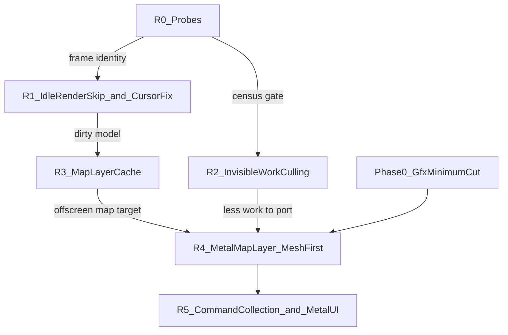

# EU IV macOS Rendering — Recommended Strategy

## Mission

Reduce EU IV's rendering cost on Apple Silicon without removing visual content, through layers of improvement that build on each other, ending at a Metal backend behind the Clausewitz Gfx layer.

This document is the forward plan. The evidence, the alternatives considered, and the ranking behind it are in [`eu4_rendering_alternatives_ranked.md`](eu4_rendering_alternatives_ranked.md). It revises the ordering of [`eu4_rendering_strategy_90pct.md`](eu4_rendering_strategy_90pct.md), whose Metal architecture (shadow state, pipeline caches, vertical slices, B→C) it keeps. State of knowledge: [`eu4_macos_rendering_findings.md`](eu4_macos_rendering_findings.md).

All savings and effort figures below are **estimates**, not measurements, unless linked to an artifact.

---

## 1. Targets and scope

A single "90%" figure mixes two very different problems. This strategy uses two targets:

| Scene type | Definition | Target | Main levers |
|---|---|---|---|
| **Static** | Paused; camera still; map unchanged (UI may or may not be active) | **~80–90% less render work**, ≥50% less process CPU-ms/s | Don't render unchanged frames or layers |
| **Active** | Camera moving or game unpaused | **30–50% less CPU per frame** | Cull invisible work; then Metal |

**Constraint:** rendering stays **lossless by default**: identical pixels for unchanged inputs and no reduced frame rate where content moves. Any lossy idle mode (S2b) needs explicit sign-off.

**Fixture:** pinned GOG 1.37.5 x86-64 under Rosetta, paused Venice, 3456×2234 at 120 Hz. Baseline: ~1,114 CPU-ms/s, ~53 swaps/s, ~21 CPU-ms/swap ([`065747Z`](../results/20260928T065747Z-autonomous/summary.md)).

---

## 2. Core thesis

The paused frame costs ~21 ms of CPU. ~74% of the main thread is rendering and ~58% sits inside the OpenGL driver's per-draw validation ([cost model](eu4_rendering_alternatives_ranked.md#1-baseline-cost-model-paused-venice)). There are three levers, applied in order of gain per effort:

1. **Do it less often:** don't redraw what hasn't changed (whole frames, then the map layer).
2. **Do less:** don't submit geometry that produces no pixels.
3. **Do it cheaper:** replace the GL driver path with a state-aware Metal backend.

Each lever leaves infrastructure the next one needs:

- the **dirty-state model** built to skip idle frames is the cache key for the map-layer cache;
- the **offscreen map target** of the layer cache is where GL and Metal meet: Metal produces the map layer, GL composites the UI;
- **culling** shrinks the work a Metal backend has to replicate and validate.

---

## 3. Phased plan

### Phase R0 — Probes and track cleanup (days)

**Deliverables:**

- **Frame-identity probe:** hash the back buffer before `CGLFlushDrawable` over consecutive paused-idle frames; report whether frames are identical and, if not, which screen regions change.
- **Per-thread CPU split** of process CPU-ms/s (main, Metal completion, audio, Galaxy SDK, Rosetta).
- **Fresh `sample` profile** on the current fixture, attributed to `GfxDraw*` / `GfxSet*` call sites, to refresh the [cost model](eu4_rendering_alternatives_ranked.md#12-main-thread-decomposition).
- **Border track wind-down:** record the mode-other / `+0x10` RE findings to date; no mutation work.

**Gate:**

- Frames identical → R1 implements lossless render-skip.
- Frames animated → decision on S2b (reduced idle rate) is needed; meanwhile R1 only skips frames when animation is provably absent, and R3 carries the static-scene savings.

**Effort:** 1–3 days.

### Phase R1 — Idle render-skip + cursor fix (1–2 weeks)

**Deliverables:**

- **Render gate:** when paused (`pause_verified()` from [`eu4_idle_pacer.c`](../benchmark/eu4_idle_pacer.c)) and no dirty signal has fired, skip `CInGameIdler::Render`, hold cadence with a sleep, and keep the last presented frame. Any input, tick, or UI change renders immediately; a maximum skip interval (250–500 ms) bounds staleness.
- **Dirty-signal model v1:** input events, game date/tick, camera matrices, map mode, hovered/selected province, open/close of UI windows. Each is logged as a counter so missed signals can be diagnosed.
- **Cursor fix:** make `-[NSCursor set]` a no-op when the cursor is unchanged.
- **Validation:** profiler-off ABABA with phase screenshots plus the R0 frame hash.

**Gate:** ≥40% lower process CPU-ms/s in paused idle; no visible difference across scripted hover/click/zoom checks; wake-up latency ≤1 frame.

**Expected savings:**

- Static idle: −50–65% CPU-ms/s and −80–90% GPU.
- Cursor fix: −2–8% frame time in all scenes.

### Phase R2 — Invisible-work culling (2–4 weeks; parallel with R1/R3)

**Deliverables:**

- **Census:** occlusion-query (counts only) or CPU frustum census of mesh and border draws: zero-sample fraction per caller, including wrap-world duplicates and the 4 border walks per frame.
- **Culling** at the `RenderBuckets` / border-walk level, only if the census clears the gate.

**Gate:** implement only if ≥10% of map draws (or of mesh driver time) are zero-sample; otherwise close it.

**Expected savings:** 0–30% of map work, in static and active scenes; lossless.

### Phase R3 — Map-layer cache (4–8 weeks)

**Deliverables:**

- **Offscreen map target:** render the map and post-effects into it, then composite it under the live UI.
- **Dirty key** reusing the R1 model, extended with province-graphics updates and any time uniforms the map shaders use.
- **Map-pass skipping** whenever the key is unchanged, with the UI still drawn at full rate.

**Gate:** map pass skipped during UI-only interaction (menus, tooltips, ledger); cached and fresh composition pixel-identical under the R0 hash; no stale highlights in scripted checks.

**Expected savings:** −55–60% per frame (~−45–55% CPU-ms/s at held cadence) while paused with active UI; nothing extra in active-camera scenes.

### Phase R4 — Metal map layer, mesh first (3–6 months)

**Prerequisites (from the existing strategy):** the Phase 0 Gfx minimum-cut map, a shader inventory, and a GLSL/ARB→MSL feasibility check for the mesh effects.

**Deliverables:**

- An IOSurface-backed shared target, so Metal renders into the R3 offscreen map texture and GL composites it.
- Shadow state → `PipelineKey` → cached `MTLRenderPipelineState`, with resource/upload lifetimes for mesh buffers and textures (existing strategy Phases 3–4).
- Mesh domain on Metal first (~44% of main-thread time, ~75% of it driver), together with whatever must share its depth buffer (likely terrain). Borders, map text, and post-effects follow as complete domains.

**Gate:** pixel parity with the GL map layer within the normal-render variation envelope; ≥20% lower CPU-ms/frame in active-camera scenes.

**Expected savings:** −25–35% per frame with mesh on Metal; −35–45% with the full map layer; all scenes.

### Phase R5 — Command collection and Metal UI (long term)

**Deliverables:** command collection and batching within the Metal map pass (original Option C), ordered by measured cost rather than draw count. UI on Metal last, which removes GL composition.

**Expected savings:** −50–60% per frame in active scenes. Combined with R1/R3, static scenes approach ~90% less render work.

---

## 4. Metrics

- **Primary:** CPU-ms per frame (swap) **and** process CPU-ms/s, plus swaps/s. The game is CPU-bound below 120 Hz VSync, so per-frame wins (R2, R4, R5) show up as higher fps rather than lower CPU-ms/s. Frame-elimination wins (R1, R3) show up as lower CPU-ms/s at held cadence.
- **Correctness:** frame hash (R0) for lossless claims; phase screenshots; scripted UI interaction checks.
- **Supporting:** combined SoC power; GPU power.
- **Structural counters (cheap, count-only):** frames skipped/s, map passes skipped/s, dirty-signal triggers by type, draws culled/s, Metal vs GL draws/frame.
- **Discipline:** keep profiler-off ABABA ([`tier1-causal-policy.md`](tier1-causal-policy.md)), fail closed when uncertain, and allow runtime toggling for every intervention.

---

## 5. Explicitly deprioritized

| Item | Why | Evidence |
|---|---|---|
| Border mode-other multi-draw | ~12% of main thread, cheap draws (~0.6 µs); ceiling ~3–7%; superseded by Metal | [ranking §3 S6](eu4_rendering_alternatives_ranked.md#3-candidate-strategies) |
| Map-text batching | <1% of main-thread samples | [cost model](eu4_rendering_alternatives_ranked.md#12-main-thread-decomposition) |
| GL setter / uniform caches | State calls are cheap; driver cost is per draw | [`state-cache-validation.md`](../analysis/state-cache-validation.md), [`sampler-uniform-validation.md`](../analysis/sampler-uniform-validation.md) |
| Static mesh pre-merging (GL) | Recurrence screening negative; throwaway under Metal | [`draw-path-decision.md`](../analysis/draw-path-decision.md) |
| Raw GL→Metal shim | Preserves per-draw churn | [`eu4_rendering_strategy_90pct.md` §4](eu4_rendering_strategy_90pct.md#4-why-not-build-a-raw-openglmetal-shim) |
| Lower global frame caps | No headroom at 60 Hz; conflicts with the full-experience requirement | [`frame-rate.md`](../analysis/frame-rate.md), [`profiling.md`](../analysis/profiling.md) |

---

## 6. Milestones (cumulative, estimates)

| Milestone | After | Static, idle | Static, UI active | Active camera / unpaused | Effort to here |
|---|---|---|---|---|---|
| Near | R0 + R1 | −50–65% CPU-ms/s | −2–8% frame time | −2–8% frame time | ~2–3 weeks |
| Medium | + R2 + R3 | −50–65% CPU-ms/s | −45–55% CPU-ms/s | −2–25% per frame (culling-dependent) | ~2–3 months |
| Long | + R4 | ~−60–70% | ~−60–70% | −25–45% per frame | ~6–9 months |
| Destination | + R5 | ~−80–90% render work | ~−70–80% | −50–60% per frame | 12+ months |

---

## 7. Open decisions

1. **Lossy idle mode (S2b):** if R0 shows the paused map is animated, may idle frames render at a reduced rate (e.g. 15–30 Hz after a few seconds without input, full rate on any input)?
2. **Border multi-draw:** close it after the RE write-up (recommended), or keep it as a low-priority side track?
