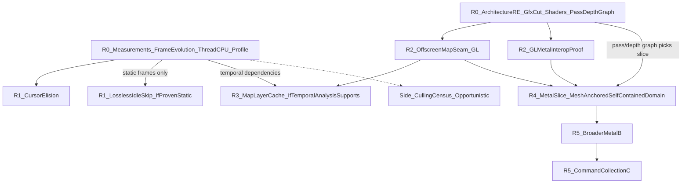

# EU IV macOS Rendering — Recommended Strategy

## Mission

Reduce EU IV's rendering cost on Apple Silicon without removing visual content, through layers of improvement that build on each other, ending at a Metal backend behind the Clausewitz Gfx layer.

This document is the forward plan, effectively **v2 of** [`eu4_rendering_strategy_90pct.md`](eu4_rendering_strategy_90pct.md). It keeps that document's renderer architecture (bottom-up RE, shadow state, pipeline caches, complete vertical slices, B→C) and changes the **ordering**: priorities follow measured cost rather than draw counts. The evidence, alternatives, and ranking behind it are in [`eu4_rendering_alternatives_ranked.md`](eu4_rendering_alternatives_ranked.md). State of knowledge: [`eu4_macos_rendering_findings.md`](eu4_macos_rendering_findings.md).

All savings and effort figures below are **estimates**, not measurements, unless linked to an artifact.

---

## 1. Targets and scope

A single "90%" figure mixes two very different problems. This strategy uses two targets:

| Scene type | Definition | Target | Main levers |
|---|---|---|---|
| **Static** | Paused; camera still; map unchanged (UI may or may not be active) | **~80–90% less render work**, ≥50% less process CPU-ms/s, **if** the frame-evolution census shows the scene is static | Don't render unchanged frames or layers |
| **Active** | Camera moving, game unpaused, or map content animating | **30–50% less CPU per frame** | Metal backend, then command collection |

**Constraint:** rendering stays **lossless by default**: identical pixels for unchanged inputs and no reduced frame rate for anything that moves. Showing an old frame while something animates is a frame-rate reduction, whatever the reason. Any lossy idle mode (S2b) is a deliberate fidelity trade-off that needs explicit sign-off; it is not part of the default plan.

**Fixture:** pinned GOG 1.37.5 x86-64 under Rosetta, paused Venice, 3456×2234 at 120 Hz. Baseline: ~1,114 CPU-ms/s, ~53 swaps/s, ~21 CPU-ms/swap ([`065747Z`](../results/20260928T065747Z-autonomous/summary.md)).

---

## 2. Core thesis

The paused frame costs ~21 ms of CPU. ~74% of the main thread is rendering and ~58% sits inside the OpenGL driver's per-draw validation ([cost model](eu4_rendering_alternatives_ranked.md#1-baseline-cost-model-paused-venice)). Mesh is ~44% of the main thread; borders ~12%; map text <1%.

The strategy runs **two tracks in parallel from day one**:

- **Elimination track:** do the work less often. Cheap fixes, then lossless frame skipping and map-layer caching, **only where measurement proves the content is static**.
- **Architecture track:** make each frame cheaper. Continue the bottom-up RE of the Gfx/OpenGL boundary, the render-pass and depth graph, and shader feasibility **now**, so that the Metal decision is not delayed behind months of caching work.

They meet at the **offscreen map seam**: the map is rendered into an offscreen target and composited under the GL UI. The seam has two independent uses:

1. it is the GL/Metal coexistence boundary: Metal produces the map layer, GL composites the UI;
2. it is the natural place to cache the map layer.

The seam has strategic value **even if caching turns out to save nothing**, so the plan does not depend on the caching hypothesis being true.

Culling is an **opportunistic side branch**: it reduces runtime workload, but not the Metal implementation surface. Effects, shader variants, vertex formats, and resources must be supported regardless, because culled objects become visible from other camera positions.

---

## 3. Phased plan

Each phase lists deliverables, a go/kill gate, expected savings, and effort. Phases on different tracks run in parallel.

### Phase R0 — Refresh the factual model (both tracks, start immediately)

**R0-M: measurement (days):**

- **Frame-evolution census** (replaces the earlier "frame identity" probe). In the paused fixture, capture consecutive frames for several seconds (downscaled back-buffer readback before `CGLFlushDrawable`, plus per-region hashes). Produce per-region change maps and classify each region as:
  - **static:** no change;
  - **periodic:** repeating animation (e.g. shader time, water, flags);
  - **continuous:** changes every frame;
  - **input-driven:** changes only after hover/click/camera input.
  
  Repeat across several map modes and zoom levels, with the UI both closed and open. Record which shader inputs carry time (time uniforms) where they can be identified.
- **Per-thread CPU split** of process CPU-ms/s (main, Metal completion, audio, Galaxy SDK, Rosetta).
- **Fresh `sample` profile** on the current fixture, attributed to `GfxDraw*` / `GfxSet*` call sites, to refresh the [cost model](eu4_rendering_alternatives_ranked.md#12-main-thread-decomposition).
- **Border track wind-down:** write up the mode-other / `+0x10` RE findings; no mutation work.

**R0-A: architecture RE (weeks, parallel; the old Phase 0, no longer deferred):**

- **Gfx/OpenGL minimum cut:** reachable draw/state/resource/present entry points, OpenGL bypasses, cached GL state that higher layers depend on (old strategy Phase 0 questions 1–7).
- **Shader/effect inventory:** where shaders are stored, the effect permutations in use in the fixture, and a GLSL/ARB → MSL feasibility sample on one mesh effect and one terrain effect.
- **Map render-pass and depth graph:** which passes write and read which color/depth/stencil targets, in what order. Specifically: do terrain, mesh, borders, and post-effects share a depth buffer, and where does `CEU3GraphicalMap::Render` hand off to post-effects and UI?

**Gates:**

- Census shows **static** map and UI regions while idle → lossless idle skip (R1) is viable.
- Census shows **periodic/continuous** regions while idle → lossless idle skip is limited to scenes and modes where those regions are absent; S2b becomes an explicit open decision, not a default.
- Minimum cut is a few dozen well-defined reachable entry points and shaders are translatable → continue the architecture track toward R2/R4. Otherwise reassess Metal scope before investing further.

**Effort:** R0-M 2–5 days; R0-A 2–4 weeks.

### Phase R1 — Cheap wins (1–2 weeks; conditional parts)

**Deliverables:**

- **Cursor fix (unconditional):** make `-[NSCursor set]` a no-op when the cursor is unchanged, or fix the tracking-area setup that triggers it. Verify cursor appearance over map and UI.
- **Lossless idle skip (only if R0-M proves the idle frame static):** when paused (`pause_verified()` from [`eu4_idle_pacer.c`](../benchmark/eu4_idle_pacer.c)), with no input and no dirty signal, skip `CInGameIdler::Render`, hold cadence with a sleep, and keep the last presented frame. Any input, tick, or UI change renders immediately. Dirty signals are counted per type for diagnosis.
  - A maximum skip interval is a **safety net against missed dirty signals in a proven-static scene only**. It does not make skipping acceptable for animated content.
- **Validation:** profiler-off ABABA with phase screenshots plus the R0 frame-evolution hashes.

**Gates:**

- Cursor fix: measurable reduction in `NSCursor set` calls/s and CPU-ms/frame or swaps/s improvement. Because the cost is partly blocking IPC, it may show as fps rather than CPU.
- Idle skip: ≥40% lower process CPU-ms/s in paused idle; skipped and rendered frames hash-identical; wake-up latency ≤1 frame.

**Expected savings (Estimate):**

- Cursor fix: −2–8% frame time in all scenes.
- Idle skip, if the census allows it: −50–65% CPU-ms/s and −80–90% GPU in static idle. If the map animates while idle: none, unless S2b is approved.

### Phase R2 — Offscreen map seam + GL↔Metal interop proof (3–6 weeks)

**Deliverables:**

- **R2a, seam (GL only):** render `CEU3GraphicalMap::Render` and the map post-effects into an offscreen target (IOSurface-backed if interop requires it) and composite it under the UI. Pixel parity with the normal path; no caching yet.
- **R2b, interop proof:** a minimal Metal producer writes into the same IOSurface-backed target (e.g. a clear plus a few test draws, then one real map draw), with correct GL/Metal synchronization and composition. Resolve whether depth must cross the boundary (from the R0-A pass/depth graph).

**Gates:** R2a: pixel parity and ≤2% CPU-ms/frame overhead from the extra composition. R2b: correct frames with no tearing or synchronization stalls visible in CPU-ms/frame.

**Expected savings:** none directly; this is the enabling seam for R3 and R4.

### Phase R3 — Map-layer cache (2–6 weeks; only if temporal analysis supports it)

**Precondition:** R0-M shows the map layer is static during common paused UI interaction (menus, tooltips, ledger) in the relevant map modes, **and** a temporal-dependency analysis identifies every input that can change map pixels (camera, map mode, hovered/selected province, date, province-graphics updates, time uniforms, effects) with a feasible way to observe each one.

**Deliverables:** cache the R2a target behind that dirty key; skip the map pass while the key is unchanged; draw the UI live at full rate.

**Gates:** cached and fresh composition hash-identical across scripted UI interaction; no stale highlights; the key's completeness is checked by periodic shadow renders compared against the cache in validation runs.

**Expected savings (Estimate):** −55–60% per frame (~−45–55% CPU-ms/s at held cadence) while paused with active UI, **if** the map is static then. Zero if the map is continuously dirty; the R2 seam remains valuable either way.

**Risk:** completeness of the dirty key in a closed-source engine with mods. Fail closed: on any uncertainty, render.

### Phase R4 — First Metal vertical slice (3–6 months)

**Prerequisites:** R0-A minimum cut, shader feasibility, and pass/depth graph; R2b interop proof.

**Slice choice:** migrate **the highest-cost self-contained map domain, with mesh as the preferred anchor**. Mesh is the economic target (~44% of the main thread, ~75% of it driver time), but a GL-terrain / Metal-mesh / GL-borders split that shares depth across APIs is a poor boundary. Let the pass/depth graph decide the minimum sensible slice, likely one of:

- **terrain + mesh** (if they share depth and borders can follow later), or
- **the whole opaque map pass**, or
- **the whole map layer** into the R2 target.

**Deliverables:** shadow state → `PipelineKey` → cached `MTLRenderPipelineState`; resource and upload lifetimes for the slice's buffers and textures; MSL ports of the slice's effects (old strategy Phases 2–4), rendered into the R2 target.

**Gate:** pixel parity with the GL path within the normal-render variation envelope; ≥20% lower CPU-ms/frame in active-camera scenes.

**Expected savings (Estimate):** −25–35% per frame for a mesh-anchored slice; −35–45% for the full map layer; all scenes.

### Phase R5 — Broader Metal (B) and command collection (C) (long term)

**Deliverables:**

- Remaining map domains on Metal as complete slices.
- Command collection and batching within the Metal map pass (original Option C), ordered by measured cost rather than draw count.
- UI on Metal last, which removes GL composition.
- Dirty/static optimizations re-applied on top of the Metal path.

**Expected savings (Estimate):** −50–60% per frame in active scenes. Combined with R1/R3, where the census allows, static scenes approach ~90% less render work.

### Side branch — Culling census (opportunistic, any time after R0-M)

**Hypothesis:** some mesh/border draws are trivially invisible: wrap-world duplicates, off-frustum objects, or one of the 4 border walks per frame.

**Approach:** prefer a **cheap CPU frustum/wrap check** over per-draw occlusion queries. Zero-sample results from occlusion queries also count draws hidden behind other objects, which cannot be cheaply predicted before rendering, and thousands of queries are intrusive.

**Gate:** implement only if ≥10% of map draws are trivially rejectable using visibility information that **already exists or is cheap at the `RenderBuckets` / border-walk level**.

**Expected savings (Estimate):** 0–20% of map work in all scenes. This is not a Metal prerequisite and does not reduce Metal implementation surface.

---

## 4. Metrics

- **Primary:** CPU-ms per frame (swap) **and** process CPU-ms/s, plus swaps/s.
  - The game is CPU-bound below 120 Hz VSync, so per-frame wins (R1 cursor, R4, R5, culling) show up as higher fps rather than lower CPU-ms/s.
  - Frame-elimination wins (R1 idle skip, R3) show up as lower CPU-ms/s at held cadence.
- **Correctness:** frame-evolution hashes (R0) for lossless claims; phase screenshots; scripted UI interaction checks; periodic shadow renders for any cache.
- **Supporting:** combined SoC power; GPU power.
- **Structural counters (cheap, count-only):** frames skipped/s, map passes skipped/s, dirty-signal triggers by type, draws culled/s, Metal vs GL draws/frame.
- **Discipline:** keep profiler-off ABABA ([`tier1-causal-policy.md`](tier1-causal-policy.md)), fail closed when uncertain, and allow runtime toggling for every intervention.

---

## 5. Explicitly deprioritized

| Item | Why | Evidence |
|---|---|---|
| Border mode-other multi-draw | ~12% of main thread, cheap draws (~0.6 µs); ceiling ~3–7%; superseded by Metal | [ranking §3 S6](eu4_rendering_alternatives_ranked.md#3-candidate-strategies) |
| Map-text batching | <1% of main-thread samples | [cost model](eu4_rendering_alternatives_ranked.md#12-main-thread-decomposition) |
| GL setter / uniform caches | State calls are cheap; driver cost is per draw | [`state-cache-validation.md`](../analysis/state-cache-validation.md), [`sampler-uniform-validation.md`](../analysis/sampler-uniform-validation.md) |
| Static mesh pre-merging (GL) | Recurrence screening negative; throwaway under Metal | [`draw-path-decision.md`](../analysis/draw-path-decision.md) |
| Raw GL→Metal shim | Preserves per-draw churn | [`eu4_rendering_strategy_90pct.md` §4](eu4_rendering_strategy_90pct.md#4-why-not-build-a-raw-openglmetal-shim) |
| Lower global frame caps | No headroom at 60 Hz; conflicts with the full-experience requirement | [`frame-rate.md`](../analysis/frame-rate.md), [`profiling.md`](../analysis/profiling.md) |
| Mixed GL/Metal within one depth-sharing pass | Hard synchronization and ordering; use complete slices into the R2 target instead | §3 R4 |

---

## 6. Milestones (cumulative, estimates)

Ranges show "census unfavourable → favourable" for the static columns; the elimination savings depend on R0-M.

| Milestone | After | Static, idle | Static, UI active | Active camera / unpaused | Elapsed time |
|---|---|---|---|---|---|
| Near | R0-M + R1 | −2–8% → −50–65% CPU-ms/s | −2–8% frame time | −2–8% frame time | ~2–3 weeks |
| Medium | + R0-A + R2 (+ R3 if supported) | −2–8% → −50–65% | −2–8% → −45–55% | −2–8% per frame | ~2–3 months |
| Long | + R4 | −25–35% per frame → ~−60–70% | −25–35% → ~−60–70% | −25–45% per frame | ~6–9 months |
| Destination | + R5 | −50–60% per frame → ~−80–90% render work | −50–60% → ~−70–80% | −50–60% per frame | 12+ months |

Even in the unfavourable case (the map animates while paused), the architecture track delivers its per-frame savings on schedule, because it no longer waits behind caching work.

---

## 7. Open decisions

1. **Lossy idle mode (S2b):** if R0-M shows the paused map animates, may idle frames render at a reduced rate (e.g. 15–30 Hz after a few seconds without input, full rate on any input)? Default: no.
2. **Border multi-draw:** close it after the RE write-up (recommended), or keep it as a low-priority side track?
3. **R4 slice boundary:** decided by the R0-A pass/depth graph; mesh-anchored by default.
