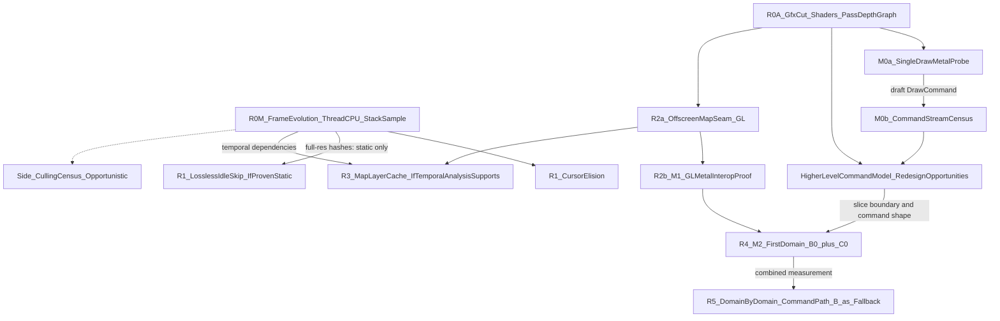

# EU IV macOS Rendering — Recommended Strategy (canonical roadmap)

## Mission

Reduce EU IV's rendering cost on Apple Silicon without removing visual content, through layers of improvement that build on each other, ending at a state-aware Metal backend behind the Clausewitz Gfx layer.

**This is the canonical roadmap.** It supersedes the earlier `eu4_rendering_strategy_90pct.md` (removed; available in git history). That document's lasting architecture (Gfx seam, shadow state, pipeline caches, complete vertical slices, B→C) is carried over in §3. Its sequencing is replaced: priorities now follow measured cost rather than draw counts.

Related documents:

- evidence, alternatives, and ranking behind this plan: [`eu4_rendering_alternatives_ranked.md`](eu4_rendering_alternatives_ranked.md);
- state of knowledge: [`eu4_macos_rendering_findings.md`](eu4_macos_rendering_findings.md).

All savings and effort figures below are **estimates**, not measurements, unless linked to an artifact.

---

## 1. Targets, scope, and metrics

### 1.1 Targets

A single "90%" figure mixes two very different problems. This strategy uses two targets:

| Scene type | Definition | Target | Main levers |
|---|---|---|---|
| **Static** | Paused; camera still; map unchanged (UI may or may not be active) | **~80–90% less render work**, ≥50% less process CPU-ms/s, **if** the frame-evolution census proves the scene static | Don't render unchanged frames or layers |
| **Active** | Camera moving, game unpaused, or map content animating | **30–50% lower main-thread wall ms/frame** (initial target, not a ceiling) | Metal domains with command-oriented callers (B0 + C0) |

**Constraint:** rendering stays **lossless by default**: identical pixels for unchanged inputs and no reduced frame rate for anything that moves. Showing an old frame while something animates is a frame-rate reduction, whatever the reason. Any lossy idle mode (S2b) is a deliberate fidelity trade-off that needs explicit sign-off; it is not part of the default plan.

**Fixture:** pinned GOG 1.37.5 x86-64 under Rosetta, paused Venice, 3456×2234 at 120 Hz. Baseline: ~1,114 process CPU-ms/s, ~53 swaps/s, ~21 process CPU-ms/swap ([`065747Z`](../results/20260928T065747Z-autonomous/summary.md)).

### 1.2 Metric definitions

These are not interchangeable. Every estimate and gate in this document names which one it uses.

| Metric | Meaning | Source |
|---|---|---|
| **Main-thread wall ms/frame** | Critical-path latency of one frame on the main thread, including blocking; determines fps while main-thread bound | `sample` shares × frame time; per-frame timestamps |
| **Process CPU-ms/swap** | CPU time consumed by **all** EU IV threads per presented frame | Per-thread CPU counters ÷ swaps |
| **Process CPU-ms/s** | Total work rate; best proxy for power | Process/thread CPU counters |
| **Swaps/s** | Delivered frame rate | `CGLFlushDrawable` counter |

**Important:** the existing cost model (mesh ~44%, GL driver ~58%, cursor ~7.5%) comes from **main-thread wall-clock sampling**, while 21.1 CPU-ms/swap is **process CPU**. Until R0-M produces per-thread CPU accounting, per-frame savings estimates in this document refer to **main-thread wall ms/frame** and are provisional. A Metal conversion may also move work between the main thread, Apple driver/runtime threads, and the GPU rather than eliminating it.

Behavior of the metrics:

- The game is main-thread bound below 120 Hz VSync, so per-frame wins (cursor fix, Metal, culling) show up mainly as **higher swaps/s**; process CPU-ms/s may stay flat until fps reaches 120.
- Frame-elimination wins (idle skip, map cache) show up as **lower process CPU-ms/s** at held cadence.

---

## 2. Core thesis

The paused frame costs ~21 process CPU-ms. In main-thread wall time, ~74% is rendering and ~58% sits inside the OpenGL driver's per-draw validation ([cost model](eu4_rendering_alternatives_ranked.md#1-baseline-cost-model-paused-venice)). Mesh is ~44% of the main thread; borders ~12%; map text <1%.

The strategy runs **two tracks in parallel from day one**:

- **Elimination track:** do the work less often. Cheap fixes, then lossless frame skipping and map-layer caching, **only where measurement proves the content static**.
- **Architecture track:** make each frame cheaper, and understand the renderer while doing so. Bottom-up RE of the Gfx/OpenGL boundary, the render-pass and depth graph, and shaders, **plus early Metal probes** (M0a/M0b), all starting now.

**Design principle: the Metal work is an abstraction-discovery exercise, not only an API replacement.** Its value cannot be estimated by replacing today's OpenGL submissions one-for-one. An explicit state/resource/command model can remove or restructure work **in the Gfx layer and its callers**, not only in the driver. The question to answer is not "how much cheaper can we execute today's rendering?" but **"what is the cheapest renderer we can build once we understand today's semantics and are no longer bound to the OpenGL execution model?"**

Rebuilding real draws, and then real draw *streams*, in Metal forces answers that static RE leaves open:

- what is pipeline state, and what varies per material, per object, per frame;
- which resources actually need rebinding;
- where ordering matters;
- what could be collected rather than submitted immediately;
- how much of today's caller work is essential semantics, how much is OpenGL-induced bookkeeping, and how much is an artifact of immediate submission order.

The answers locate the gains at each layer:

| Layer | Today | Metal/command-oriented form |
|---|---|---|
| 1. Backend | GL driver validates dirty state per draw | Explicit, cached Metal state |
| 2. Gfx API | `GfxSetShader` / `GfxSetTextures` / `GfxSetVertexBuffers` / constants / `GfxDraw*` | `Submit(DrawCommand)` |
| 3. Object renderer | `CPdxMeshObject::RenderBuckets` mutates graphics state, then draws | Object describes a compact command |
| 4. Bucket/pass renderer | Thousands of immediate submissions | Collect, partition by order constraints, group compatible opaque work, encode compactly |
| 5. Frame/pass structure | Passes inferred from a stream of GL state changes | Explicit terrain / mesh / border / text / UI passes |

Today's ~16% engine-side render work is the cost of the **current OpenGL-oriented** caller architecture; it is not necessarily irreducible after layers 2–4 change.

Metal has three stages, kept distinct:

| Stage | Purpose | When |
|---|---|---|
| **M0a** — single-draw probe | One representative mesh draw reproduced in Metal outside the game; GL vs Metal per-draw CPU microbenchmark; draft `DrawCommand` | R0-A, immediately |
| **M0b** — command-stream census | Whole captured `RenderBuckets` sequences converted offline into candidate `DrawCommand`s; state-entropy and regrouping analysis | R0-A, after M0a |
| **M1** — GL↔Metal interop proof | Metal writes into the game's offscreen map target; GL composites | R2b, after the seam exists |
| **M2** — first real domain | Highest-cost self-contained map domain on Metal in the game, with both a compatibility path (B0) and a command path (C0) | R4 |

The tracks meet at the **offscreen map seam**: the map is rendered into an offscreen target and composited under the GL UI. The seam has two independent uses:

1. it is the GL/Metal coexistence boundary: Metal produces the map layer, GL composites the UI;
2. it is the natural place to cache the map layer.

The seam is worth building **even if caching turns out to save nothing**.

Culling is an **opportunistic side branch**. It reduces runtime workload but not the Metal implementation surface: effects, shader variants, vertex formats, and resources must be supported regardless, because culled objects become visible from other camera positions.



---

## 3. Target architecture (carried over from the earlier strategy)

### 3.1 Use the Gfx abstraction as the migration seam

The executable funnels draw submission through a small Clausewitz graphics layer. There are 48 direct `GfxDraw*` call/jump sites in four helper families (`GfxDraw`, `GfxDrawIndexed`, `GfxDrawIndexedInstanced`, `GfxDraw2dLines`) ([`analysis/draw-callers.json`](../analysis/draw-callers.json)), plus `GfxSet*`, buffer, texture, and effect abstractions. Replace the backend at that boundary rather than rewriting high-level renderers. Whether state, resource, render-target, and present paths are equally centralized is an R0-A question.

### 3.2 Why not a raw GL→Metal shim

Translating OpenGL calls one-to-one would remove Apple's GL layer but keep the bind/set/upload/draw churn that the driver currently validates per draw. Metal pays off with explicit render passes, cached immutable pipeline states, explicit resource ownership, fewer redundant bindings, and batched command streams. The Gfx boundary exposes more intent than raw GL calls, so it is the better interception point.

### 3.3 Option B — state-aware Metal backend behind Gfx semantics

Keep a shadow state instead of emitting Metal commands for every legacy setter:

```text
CurrentRenderState
    shader/effect, vertex layout, vertex/index buffers,
    textures/samplers, blend, depth/stencil, raster,
    constants, render targets
```

At draw time:

```text
GfxDraw* → derive PipelineKey → lookup/cache MTLRenderPipelineState
        → bind only changed resources/state → encode Metal draw
```

Requirements:

- **Pipeline/state caches:** cache PSOs, depth/stencil states, samplers, vertex descriptors, and binding layouts; never build them in hot draws.
- **Resources:** GL buffer/texture IDs do not become Metal resources by aliasing; explicit upload and lifetime rules are needed.
- **Dynamic constants:** ring buffers.
- **Shaders:** a GLSL/ARB → MSL path, with effect permutations mapped to pipeline keys. Shader feasibility may dominate total backend effort.

### 3.4 Option C — command collection and caller redesign

Move from immediate translation toward collected commands within safe pass/order classes:

```text
DrawCommand
    pipeline_key, geometry, resources (textures/samplers),
    constant ranges, depth/order class, draw arguments
```

Group and batch within those classes to minimize pipeline and resource changes. Where it pays, change the callers so they emit commands directly instead of mutating Gfx state (layers 2–4 in §2). M0a drafts the command shape for mesh; M0b shows how a real stream of such commands could be regrouped.

### 3.4.1 B is the compatibility substrate, not the performance architecture

B (faithful Gfx semantics on Metal) exists for **correctness and fallback**: it lets a domain run on Metal before its callers change, and gives a reference to compare against. It is not where most of the performance is expected to come from. Do **not** build out a broad B backend and only then explore C: that risks months of faithfully reproducing OpenGL-era semantics in Metal and then replacing them. Each domain gets a minimal B path (B0) and, from the start, a command-oriented path (C0).

**Risk of caller redesign:** layers 3–4 mean detouring or replacing closed-source x86-64 code above the Gfx layer (e.g. the `RenderBuckets` loop), not just swapping a backend. That code is harder to reverse-engineer and patch, more version-pinned, and more exposed to mods. Scope C0 per domain to call sites whose data flow is fully understood. The B0 path remains the fail-closed fallback.

### 3.5 Architectural principles

1. **Map bottom-up, implement as complete vertical slices.** A slice includes shaders, resources, pass/target, draws, and composition; do not bring up all `GfxDraw*` families horizontally while the rest stays on GL.
2. **Never mix GL and Metal inside one depth-sharing pass.** Cross the API boundary only at offscreen targets (§3.6).
3. **Optimize above the driver when possible.** Removing work before it reaches GL or Metal beats making the same work cheaper.
4. **Keep a correct compatibility path, but don't let it become the architecture.** Every Metal domain has a B0 path that is correct and serves as fallback; its command path (C0) is developed alongside, not after a broad B rollout.
5. **Do not globally reorder rendering.** Respect pass, transparency, UI, and post-process ordering.
6. **Prioritize by measured cost, not draw count.**
7. **Fail closed.** On any uncertainty about equivalence or cache validity, take the original path.
8. **Every phase produces a measurable win or a decisive feasibility answer.**

### 3.6 GL/Metal coexistence

The coexistence boundary is the offscreen map target, IOSurface-backed so both APIs can address it. Metal renders the map layer into it, GL composites the UI over it, with explicit synchronization. Whether depth must cross the boundary is decided by the R0-A pass/depth graph.

---

## 4. Phased plan

Each phase lists deliverables, a go/kill gate (naming its metric), expected savings, and effort. Phases on different tracks run in parallel.

### Phase R0 — Refresh the factual model (both tracks, start immediately)

**R0-M: measurement (days):**

- **Frame-evolution census** (replaces the earlier "frame identity" probe).
  - **Equality predicate (authoritative):** exact hash/CRC of the **full-resolution** back buffer before `CGLFlushDrawable`, over several seconds of consecutive paused frames. Only full-resolution equality can authorize lossless skipping; downscaling can hide a small flag, highlight, or pulse.
  - **Localization (diagnostic only):** once two frames differ, compute per-region hashes and downscaled difference maps to find where and how the frame changes. Classify each region as:
    - **static:** no change;
    - **periodic:** repeating animation (e.g. shader time, water, flags);
    - **continuous:** changes every frame;
    - **input-driven:** changes only after hover/click/camera input.
  - Repeat across several map modes and zoom levels, with the UI both closed and open. Record which shader inputs carry time (time uniforms) where they can be identified.
- **Per-thread CPU accounting:** actual CPU-time counters per thread (Mach `task_threads` + `thread_info(THREAD_BASIC_INFO)` user/system time deltas, or an equivalent counter-based tool). This splits process CPU-ms/s into main, Metal completion, audio, Galaxy SDK, and Rosetta threads. `sample` cannot do this: it records where each thread was, including blocked threads.
- **Stack attribution (separate experiment):** a fresh `sample` profile on the current fixture, attributed to `GfxDraw*` / `GfxSet*` call sites. It refreshes the main-thread wall-time [cost model](eu4_rendering_alternatives_ranked.md#12-main-thread-decomposition) and is interpreted as latency attribution, not CPU accounting.
- **Border track wind-down:** write up the mode-other / `+0x10` RE findings; no mutation work.

**R0-A: architecture RE and Metal learning probe (weeks, parallel):**

- **Gfx/OpenGL minimum cut:**
  - which Gfx functions must emit or synchronize OpenGL for normal rendering (draw, state, resource, render-target, present);
  - OpenGL calls that bypass the Gfx layer;
  - GL-specific cached state that higher layers depend on.
- **Shader/effect inventory:** where shaders are stored and compiled, and the effect permutations used in the fixture.
- **Map render-pass and depth graph:** which passes write and read which color/depth/stencil targets, in what order. Specifically: do terrain, mesh, borders, and post-effects share a depth buffer, and where does `CEU3GraphicalMap::Render` hand off to post-effects and UI?
- **M0a — single-draw Metal probe (≈1–2 weeks, no game integration):**
  1. Trace one representative mesh draw end to end: `CPdxMeshObject::RenderBuckets` → effect selection → `GfxSet*` → `GfxDrawIndexed` → GL state → `glDrawElements`. Count Gfx and GL calls per draw.
  2. Capture its real vertex/index data, textures, constants, and shader, and reproduce the draw in a standalone x86-64 Metal harness under Rosetta. This includes MSL translation of the effect, `MTLRenderPipelineState`, and `drawIndexedPrimitives` into an offscreen texture, compared with the GL output.
  3. **Microbenchmark:** N draws with EU4-like churn (buffer, texture, constant, and pipeline changes at realistic rates) through the GL path vs the equivalent Metal path. Report CPU µs/draw (thread CPU counters).
  4. Write down the **semantic compression**: how the GL call sequence collapses into `PipelineKey`, resource set, constant block, and draw arguments. That is the draft `DrawCommand`.
- **M0b — command-stream census (≈1–2 weeks, after M0a; offline analysis of captured streams):**
  1. Capture 1–10 complete `RenderBuckets` sequences with the per-draw Gfx state. Use count-only, observer-style capture; timing is not needed.
  2. Convert them offline into candidate `DrawCommand`s.
  3. Report:
     - distinct pipeline keys per frame;
     - how often only geometry, only constants, or only one texture changes between consecutive commands;
     - same-pipeline run lengths;
     - ordering constraints (transparency, depth class) that prevent regrouping;
     - the achievable command count after legal grouping, e.g. instanced or merged submissions.
  4. Classify the work `RenderBuckets` does per draw into three kinds: essential semantics, bookkeeping that exists only to establish immediate GL state, and submission-order artifacts. Note which data could be written directly into a compact command buffer.
  5. Output: a ranked list of upstream (caller-level) redesign opportunities for the first real domain.

**Gates:**

- **Idle skip (full-resolution equality):**
  - Census shows full-resolution identical idle frames → lossless idle skip (R1) is viable.
  - Census shows **periodic/continuous** regions while idle → lossless idle skip is limited to scenes and modes where those regions are absent; S2b becomes an explicit open decision, not a default.
- **Architecture:** the minimum cut must be a few dozen well-defined reachable entry points, and shaders must be translatable; otherwise reassess Metal scope before investing further.
- **M0a/M0b decide where the gains must come from, not whether Metal is worth it.**
  - **Large direct win** (Metal per-draw CPU ≤~25% of GL): API replacement alone carries much of the domain's saving; C0 adds to it.
  - **Moderate direct win** (Metal at 50–70% of GL): most of the value must come from changing the work presented to Metal. M0b's regrouping and caller-redesign opportunities become the primary target for C0, which makes early command-oriented work **more** important, not less.
  - **Kill criterion:** reassess the Metal track only if both are weak: a small direct per-draw win **and** an M0b census showing little legal regrouping or caller simplification (e.g. achievable command count close to today's draw count, with most caller work essential).

**Effort:** R0-M 2–5 days; R0-A 2–4 weeks of RE plus 2–4 weeks for M0a + M0b, in parallel.

### Phase R1 — Cheap wins (1–2 weeks; conditional parts)

**Deliverables:**

- **Cursor fix (unconditional):** make `-[NSCursor set]` a no-op when the cursor is unchanged, or fix the tracking-area setup that triggers it. Verify cursor appearance over map and UI.
- **Lossless idle skip (only if R0-M proves the idle frame full-resolution static):**
  - When paused (`pause_verified()` from [`eu4_idle_pacer.c`](../benchmark/eu4_idle_pacer.c)), with no input and no dirty signal, skip `CInGameIdler::Render`, hold cadence with a sleep, and keep the last presented frame.
  - Any input, tick, or UI change renders immediately. Dirty signals are counted per type for diagnosis.
  - A maximum skip interval is a **safety net against missed dirty signals in a proven-static scene only**. It does not make skipping acceptable for animated content.
- **Validation:** profiler-off ABABA with phase screenshots plus full-resolution frame hashes.

**Gates:**

- **Cursor fix:** measurable drop in `NSCursor set` calls/s, plus lower main-thread wall ms/frame or higher swaps/s. Because the cost is partly blocking IPC, it may not reduce process CPU-ms/swap.
- **Idle skip:** ≥40% lower process CPU-ms/s in paused idle; skipped and rendered frames full-resolution hash-identical; wake-up latency ≤1 frame.

**Expected savings (Estimate):**

- Cursor fix: −2–8% main-thread wall ms/frame in all scenes.
- Idle skip, if the census allows it: −50–65% process CPU-ms/s and −80–90% GPU in static idle. If the map animates while idle: none, unless S2b is approved.

### Phase R2 — Offscreen map seam, then GL↔Metal interop (M1) (3–6 weeks)

**R2a — seam (GL only):** render `CEU3GraphicalMap::Render` and the map post-effects into an IOSurface-backed offscreen target and composite it under the UI. Pixel parity with the normal path; no caching yet.

**R2b — interop proof (M1):** a minimal Metal producer, reusing the M0a harness code, writes into the R2a target inside the running game. Start with a clear and test draws, then one real map draw. GL synchronization and composition must be correct. Whether depth must cross the boundary follows the R0-A pass/depth graph.

**Dependency order:** R0-A → R2a seam → R2b interop → R4.

**Gates:**

- **R2a:** full-resolution pixel parity; ≤2% added main-thread wall ms/frame for the extra composition.
- **R2b:** correct frames with no tearing; no synchronization stalls visible in main-thread wall ms/frame.

**Expected savings:** none directly; this is the enabling seam for R3 and R4.

### Phase R3 — Map-layer cache (2–6 weeks; only if temporal analysis supports it)

**Precondition:** R0-M shows (full-resolution) that the map layer is static during common paused UI interaction (menus, tooltips, ledger) in the relevant map modes. A temporal-dependency analysis must also identify every input that can change map pixels (camera, map mode, hovered/selected province, date, province-graphics updates, time uniforms, effects), with a feasible way to observe each one.

**Deliverables:** cache the R2a target behind that dirty key; skip the map pass while the key is unchanged; draw the UI live at full rate.

**Gates:**

- Cached and fresh composition are full-resolution hash-identical across scripted UI interaction, with no stale highlights.
- Key completeness is checked by periodic shadow renders compared against the cache in validation runs.

**Expected savings (Estimate):** −45–55% process CPU-ms/s at held cadence while paused with active UI, **if** the map is static then. Zero if the map is continuously dirty; the R2 seam remains valuable either way.

**Risk:** completeness of the dirty key in a closed-source engine with mods. Fail closed: on any uncertainty, render.

### Phase R4 — First real Metal domain (M2): B0 + C0 (3–6 months)

**Prerequisites:**

- R0-A: minimum cut, shader feasibility, and pass/depth graph;
- M0a per-draw result and draft `DrawCommand` shape;
- M0b command-stream census and ranked caller-redesign opportunities;
- the R2b interop proof.

**Slice choice:** migrate **the highest-cost self-contained map domain, with mesh as the preferred anchor**. Mesh is the economic target (~44% of main-thread wall time, ~75% of it driver), but a GL-terrain / Metal-mesh / GL-borders split that shares depth across APIs is a poor boundary. The pass/depth graph decides the minimum sensible slice, likely one of:

- **terrain + mesh**, if they share depth and borders can follow later;
- **the whole opaque map pass**;
- **the whole map layer** into the R2 target.

**Deliverables, for the same domain:**

- **B0 — minimal compatibility path:** the §3.3 design, only as broad as the domain requires: shadow state, pipeline cache, resources, and MSL effects, rendered into the R2 target. It provides correctness, a pixel reference, and the fail-closed fallback.
- **C0 — command-oriented path:** the domain's callers (starting with the top M0b opportunities) emit `DrawCommand`s that are collected, grouped within legal order classes, and encoded compactly. It is toggleable against B0 at runtime.

**Measurement:** report the combined effect, decomposed:

- backend replacement (GL vs B0);
- caller simplification and command reduction (B0 vs C0);
- the total (GL vs C0);

all in main-thread wall ms/frame, with per-thread CPU accounting (work can move to driver/runtime threads or the GPU).

**Gate:** pixel parity with the GL path within the normal-render variation envelope for both B0 and C0; ≥20% lower main-thread wall ms/frame for C0 in active-camera scenes.

**Expected savings (Estimate; provisional until M0a/M0b and R0-M):**

- B0 alone: −25–35% main-thread wall ms/frame for a mesh-anchored domain;
- C0 adds a further, currently unquantified reduction that M0b will bound;
- all scenes.

### Phase R5 — Expand domain by domain (long term)

**Deliverables:**

- Remaining map domains on Metal, each with B0 + C0, ordered by measured cost.
- Explicit pass structure (layer 5 in §2) once enough domains are command-oriented.
- UI on Metal last, which removes GL composition.
- Dirty/static optimizations re-applied on top of the Metal path.

**Expected savings (Estimate, main-thread wall ms/frame):** −50–60% in active scenes is the current working estimate for backend + command collection with today's caller structure. It is **not a ceiling**: caller redesign can also reduce the ~16% engine-side render work, which this estimate treats as fixed. Combined with R1/R3, where the census allows, static scenes approach ~90% less render work.

### Side branch — Culling census (opportunistic, any time after R0-M)

**Hypothesis:** some mesh/border draws are trivially invisible: wrap-world duplicates, off-frustum objects, or one of the 4 border walks per frame.

**Approach:** prefer a **cheap CPU frustum/wrap check** over per-draw occlusion queries. Zero-sample results from occlusion queries also count draws hidden behind other objects, which cannot be cheaply predicted before rendering, and thousands of queries are intrusive.

**Gate (cost-based, not draw-count-based):** implement only if the census predicts **≥3–5% lower main-thread wall ms/frame**. The prediction weights each rejectable draw by its caller's measured cost: mesh draws are ~3.5× border draws per call. The visibility test must also cost substantially less than that saving, using information that already exists or is cheap at the `RenderBuckets` / border-walk level.

**Expected savings (Estimate):** 0–20% of map work in all scenes. This is not a Metal prerequisite and does not reduce Metal implementation surface.

---

## 5. Measurement discipline

- Use the metric definitions of §1.2. Gates and estimates always name their metric.
- **Correctness:**
  - full-resolution frame hashes for any lossless claim;
  - phase screenshots;
  - scripted UI interaction checks;
  - periodic shadow renders for any cache.
- **CPU accounting:** per-thread CPU counters. `sample` is for stack attribution only.
- **Supporting:** combined SoC power; GPU power.
- **Structural counters (cheap, count-only):** frames skipped/s, map passes skipped/s, dirty-signal triggers by type, draws culled/s, Metal vs GL draws/frame.
- **Discipline:** profiler-off ABABA ([`tier1-causal-policy.md`](tier1-causal-policy.md)); fail closed when uncertain; runtime toggling for every intervention.

---

## 6. Explicitly deprioritized

| Item | Why | Evidence |
|---|---|---|
| Border mode-other multi-draw | ~12% of main thread, cheap draws (~0.6 µs); ceiling ~3–7%; superseded by Metal | [ranking §3 S6](eu4_rendering_alternatives_ranked.md#3-candidate-strategies) |
| Map-text batching | <1% of main-thread samples | [cost model](eu4_rendering_alternatives_ranked.md#12-main-thread-decomposition) |
| GL setter / uniform caches | State calls are cheap; driver cost is per draw | [`state-cache-validation.md`](../analysis/state-cache-validation.md), [`sampler-uniform-validation.md`](../analysis/sampler-uniform-validation.md) |
| Static mesh pre-merging (GL) | Recurrence screening negative; throwaway under Metal | [`draw-path-decision.md`](../analysis/draw-path-decision.md) |
| Raw GL→Metal shim | Preserves per-draw churn | §3.2 |
| Lower global frame caps | No headroom at 60 Hz; conflicts with the full-experience requirement | [`frame-rate.md`](../analysis/frame-rate.md), [`profiling.md`](../analysis/profiling.md) |
| Mixed GL/Metal within one depth-sharing pass | Hard synchronization and ordering; use complete slices into the R2 target instead | §3.5–3.6 |

---

## 7. Milestones (cumulative, estimates)

Ranges in the static columns run from "census unfavourable" to "census favourable"; elimination savings depend on R0-M. Static columns use process CPU-ms/s; active columns use main-thread wall ms/frame.

| Milestone | After | Static, idle | Static, UI active | Active camera / unpaused | Elapsed time |
|---|---|---|---|---|---|
| Near | R0-M + R1 | −0–5% → −50–65% | −0–5% | −2–8% | ~2–3 weeks |
| Medium | + R0-A + M0a/M0b + R2 (+ R3 if supported) | −0–5% → −50–65% | −0–5% → −45–55% | −2–8% | ~2–3 months |
| Long | + R4 | ~−20–30% → ~−60–70% | ~−20–30% → ~−60–70% | −25–45% | ~6–9 months |
| Destination | + R5 | ~−40–50% → ~−80–90% render work | ~−40–50% → ~−70–80% | −50–60% or more (caller redesign not included) | 12+ months |

Even in the unfavourable case (the map animates while paused), the architecture track delivers its per-frame savings on schedule, because it no longer waits behind caching work. Static-scene figures under the unfavourable census assume per-frame savings convert into process CPU only at held cadence; they are the most uncertain numbers here.

---

## 8. Open decisions

1. **Lossy idle mode (S2b):** if R0-M shows the paused map animates, may idle frames render at a reduced rate (e.g. 15–30 Hz after a few seconds without input, full rate on any input)? Default: no.
2. **Border multi-draw:** close it after the RE write-up (recommended), or keep it as a low-priority side track?
3. **R4 slice boundary:** decided by the R0-A pass/depth graph and M0a/M0b; mesh-anchored by default.
