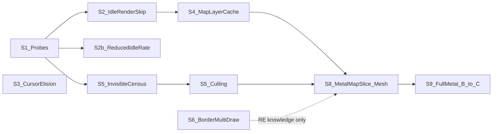

# EU IV macOS Rendering — Strategy Assessment, Alternative Hypotheses, and Ranking

## Purpose

This document reviews the current plan in [`eu4_rendering_strategy_90pct.md`](eu4_rendering_strategy_90pct.md) against evidence already in the repository, lists alternative hypotheses with effort and savings estimates, and ranks all candidates by expected performance gain per unit of effort, with a bias toward work that later steps can build on.

The resulting forward plan is in [`eu4_recommended_strategy.md`](eu4_recommended_strategy.md). State of knowledge: [`eu4_macos_rendering_findings.md`](eu4_macos_rendering_findings.md).

**Evidence labels used below:**

- **Measured:** read directly from a repo artifact (linked).
- **Derived:** arithmetic on measured values.
- **Estimate:** engineering judgement; not measured. All effort and savings figures are estimates.

---

## 1. Baseline cost model (paused Venice)

### 1.1 Process-level baseline

Measured, profiler-off autonomous baseline ([`results/20260928T065747Z-autonomous/summary.md`](../results/20260928T065747Z-autonomous/summary.md)):

| EU IV CPU ms/s | CPU W | GPU W | Combined W | Swaps/s | CPU ms/swap |
|---:|---:|---:|---:|---:|---:|
| 1,113.69 | 7.47 | 2.01 | 9.50 | 52.78 | 21.1 |

The display runs at 120 Hz with VSync ([`analysis/frame-rate.md`](../analysis/frame-rate.md)), but the game delivers ~50–60 swaps/s. The main thread is the bottleneck, not VSync. GPU power (~2 W) is small next to CPU power (~7.5 W), so this is a CPU-side problem.

### 1.2 Main-thread decomposition

Measured from the paused-Venice `sample` capture [`results/20260926T210454Z-paused-cpu/cpu-sample.txt`](../results/20260926T210454Z-paused-cpu/cpu-sample.txt) (10 s, 477 main-thread stack samples, outermost-frame counting):

| Branch | Samples | Share of main thread |
|---|---:|---:|
| `CInGameIdler::Render` (all rendering) | 352 | **73.8%** |
| ↳ `CEU3GraphicalMap::Render` (map) | 291 | 61.0% |
| ↳↳ `CGraphics::RenderBuckets` (mesh objects) | 211 | **44.2%** |
| ↳↳↳ `CPdxMeshObject::RenderBuckets` | 198 | 41.5% |
| ↳↳↳↳ inside `glDrawElements` (driver) | 158 | **33.1%** |
| ↳↳ `CPdxMap::Render` (terrain + borders) | 71 | 14.9% |
| ↳↳↳ `CPdxMapBorderLayer::DrawBorders` | 59 | 12.4% |
| ↳↳ `CCountryNameCollection` (map text) | 4 | 0.8% |
| ↳ `CGraphics::Render2dObjectsToScreen` (UI) | 42 | 8.8% |
| ↳ `CGraphics::PresentScene` | 12 | 2.5% |
| Simulation / UI update inside `Idle` (non-render) | ~43 | ~9% |
| `CPdxProgram::UpdateInput` (event pump) | 82 | 17.2% |
| ↳ `-[NSCursor set]` → `SLSGetCursorScale` (WindowServer IPC) | 36 | **7.5%** |

Derived: stack frames entering GLEngine / libGL directly from `eu4` code account for **276 / 477 = 57.9%** of main-thread samples. Engine-side render work outside the driver is therefore roughly **352 − 276 ≈ 76 samples ≈ 16%**. The driver hot spots under `glDrawElements` are per-draw validation: `GLDContextRec::setRenderState`, `setRenderSamplersAndTextures`, `prepareResourceForGPUAccess` / `GLRResourceList::addResource` (with `malloc`), and uniform uploads via `setVertexBytes` / `setFragmentBytes`.

### 1.3 Per-call driver cost

Measured inclusive sampled time, full-telemetry phase of [`results/20260927T102247Z-diagnostic/root-cause.md`](../results/20260927T102247Z-diagnostic/root-cause.md) (intrusive; ratios are more trustworthy than absolutes):

| Call | Calls/s | Inclusive ms/s | Derived µs/call |
|---|---:|---:|---:|
| `glDrawElements` | 107,815 | 234.7 | **~2.2** |
| `glDrawElementsBaseVertex` | 98,708 | 60.7 | **~0.6** |
| `glDrawArrays` | 16,130 | 33.9 | ~2.1 |
| all state calls combined (`glUniform*`, attrib, bind, tex) | ~4.1 M | ~165 | ~0.04 |

Derived: per frame in the same run's lighter "Paused Idle" phase (132,636 and 121,422 calls/s at 48.0 swaps/s), `glDrawElements` ≈ 2,760/frame, which matches mesh (~2,774/frame); `glDrawElementsBaseVertex` ≈ 2,530/frame, which matches borders (2,285) plus text/UI. **Inference:** mesh draws are ~3.5× more expensive per call than border draws. State calls are individually cheap; cost is concentrated at draw time, when the driver revalidates dirty state.

### 1.4 Caveats

- `sample` stacks are wall-clock snapshots. A sample can include blocking time; e.g. the cursor path ends in `mach_msg`, so its share is main-thread latency, not necessarily EU IV CPU.
- The CPU sample (2026-09-26) predates the current harness; the scene was the same paused Venice fixture at 3456×2234 / 120 Hz, but camera state was not independently controlled.
- The per-call table comes from an intrusive run that lost ~20% swap rate; treat absolute µs as upper bounds.
- Other threads (Metal completion queue, audio, GOG Galaxy SDK, Rosetta) make up the gap between main-thread time and ~1,110 CPU-ms/s. They are not broken down yet.

---

## 2. Assessment of the current strategy

**What is right.** Replacing the OpenGL backend at the Clausewitz Gfx boundary, with shadow state and cached pipeline objects, is the correct long-run architecture. A raw GL→Metal shim would preserve the per-draw churn the driver is already paying for. Metal is also the only lever with a high ceiling for **active** scenes (unpaused, camera moving), where frames genuinely differ.

**What is not the most promising, as sequenced:**

1. **Prioritization by draw count instead of cost.** Borders are 39% of draws but ~12% of main-thread time; mesh is 47% of draws but ~44% of time. The border multi-draw track (Phase 1, and the recent census work) has a realistic **ceiling of ~3–7% per frame** (Estimate: borders' ~12% share, minus the irreducible per-sub-draw driver work that `glMultiDrawElementsBaseVertex` still does). Since the border harness work began (2026-10-04), several Venice runs have produced zero eliminations ([`border-loop-head-roi-live-20261007T055904Z.json`](../analysis/evidence/border-loop-head-roi-live-20261007T055904Z.json)). Map text, the planned second batching target, is <1% of main-thread time.
2. **Open question 7 is already answered by existing data.** ~58% of the main thread is inside the GL driver, ~16% is engine-side render work (§1.2). This also explains why the GL setter caches failed: they eliminated ~1.1 M calls/s of cheap state calls ([`analysis/state-cache-validation.md`](../analysis/state-cache-validation.md): ~1% CPU change; [`analysis/sampler-uniform-validation.md`](../analysis/sampler-uniform-validation.md): no gain) without reducing the per-draw validation the driver does anyway.
3. **The static-scene 90% target is out of reach of the backend path alone.** Even an ideal Metal backend + command collection leaves engine-side render setup (~16%), simulation/UI update (~9%), and the event pump (~17%). Estimate: B+C tops out around **50–60% less CPU per frame**. 90% in a static scene requires *not rendering unchanged frames*, which the strategy defers to Phase 8, the last phase.
4. **The outcome metric hides per-frame wins.** The game is CPU-bound below the 120 Hz VSync ceiling. Making a frame cheaper raises swaps/s; CPU-ms/s stays roughly flat until fps reaches 120. Batching or Metal results must be reported as **CPU-ms per frame** (and swaps/s), or paired with a cadence-holding cap, otherwise real wins look like zero.
5. **GL/Metal coexistence is the hidden crux, and the plan doesn't yet say where it will be.** Interleaving Metal mesh draws into a GL pass that shares depth with terrain and borders is the hardest integration problem in the plan. A map-layer cache (S4 below) creates a clean seam: the whole map is produced into an offscreen target and composited under the UI. Building that seam first, in GL, gives Metal a well-defined place to plug in later.
6. **A cheap non-rendering cost was missed.** ~7.5% of main-thread time is AppKit re-setting the cursor on every event pump (`NSCursor set` → WindowServer IPC).

**Verdict:** keep the Gfx→Metal architecture as the long-term destination, but reorder: measure first, then eliminate redundant frames and layers, then cull invisible work, and enter Metal through the map-layer seam with **mesh** as the first domain. Stop investing in border/text batching beyond writing up the RE already done.

---

## 3. Candidate strategies

Savings are given for two scene types:

- **Static:** paused, camera still, no input (the fixture).
- **Active:** camera moving or game unpaused, frames genuinely change.

"Per frame" savings convert into higher fps below 120 Hz; "CPU-ms/s" savings assume cadence is held.

### S1 — Cheap measurement probes

- **Mechanism:** three probes, no mutation.
  1. **Frame identity:** hash the back buffer (`glReadPixels` downscaled, or a CRC over a PBO readback) just before `CGLFlushDrawable` for N consecutive paused-idle frames. Are paused frames pixel-identical, and if not, which regions change (animated shaders, trees, flags)?
  2. **Per-thread CPU:** `ps -M` / `top -stats` per thread, or thread CPU from a fresh `sample`, to split the ~1,110 CPU-ms/s into main thread vs Metal completion, audio, Galaxy SDK, Rosetta.
  3. **Fresh profile at Gfx granularity:** a new `sample` on the current fixture, attributing samples to `GfxDrawIndexed` / `GfxSetTextures` / `GfxSetShader` call sites.
- **Evidence:** [`analysis/diagnostic.md`](../analysis/diagnostic.md) states the map is animated; the diagnostic screenshot pair showed ~60% of pixels changed, but those shots were minutes apart and not controlled for camera.
- **Falsifies:** S2 lossless viability (probe 1); "non-render threads are negligible" (probe 2).
- **Effort:** 1–3 days. **Savings:** none directly; it decides between S2 and S2b and validates §1.
- **Building-block value:** high; the frame hash becomes the correctness oracle for S2 and S4.
- **Risk:** low.

### S2 — Idle render-skip (dirty-driven frames)

- **Mechanism:** when the game reports paused (reuse `pause_verified()` from [`benchmark/eu4_idle_pacer.c`](../benchmark/eu4_idle_pacer.c)), no input has arrived, and no dirty signal fired, skip `CInGameIdler::Render` entirely and sleep to hold cadence. The window keeps showing the last presented frame. Any input, tick, UI change, or dirty signal renders immediately. **Note:** the existing pacer only caps at 60 Hz, so it has no headroom at ~55 fps; true render-skipping has never been tested.
- **Variant S2b (lossy, needs your approval):** if S1 shows the paused map is animated, render idle frames at a reduced rate (e.g. 15–30 Hz) instead of skipping them entirely.
- **Evidence:** rendering is 74% of the main thread (§1.2); the GPU does nothing on skipped frames.
- **Falsifies:** S1 frame-identity probe; ABABA with phase screenshots.
- **Effort:** 1–2 weeks (Estimate). Hooking `Render` from the `Idle` call site; making sure nothing is presented from an undefined back buffer; defining dirty signals.
- **Savings (Estimate):**
  - Static, ≥90% of frames skipped: **50–65% process CPU-ms/s, 80–90% GPU power.**
  - Active: 0.
  - S2b at 20 Hz: ~35–50% process CPU-ms/s.
- **Building-block value:** high; the dirty-signal model and render gate are reused by S4 and by any future pass-level caching.
- **Risk:** input latency on wake-up (one frame); missed dirty signals leave a stale screen (mitigated by a maximum skip interval, e.g. 250–500 ms); conflict with the earlier full-experience requirement if frames are not identical.

### S3 — Redundant cursor-set elision

- **Mechanism:** on every event pump, AppKit's display-cycle observer calls `-[NSCursor set]` via `cursorUpdate:`, which IPCs to WindowServer (`SLSGetCursorScale`). Interpose so it becomes a no-op when the same cursor is already set, or fix the SDL tracking-area / cursor-rect setup that triggers it.
- **Evidence:** 36/477 main-thread samples (7.5%) (§1.2).
- **Falsifies:** a counter on `-[NSCursor set]` calls/s, then ABABA on swaps/s and CPU-ms/frame; check the cursor is still correct over UI elements and the map.
- **Effort:** 1–3 days. **Savings (Estimate):** 2–8% main-thread frame time in all scenes; mostly appears as fps and WindowServer load, since the time is partly blocking IPC.
- **Building-block value:** low (independent of rendering).
- **Risk:** low; cursor appearance regressions are immediately visible.

### S4 — Map-layer cache (offscreen map, live UI)

- **Mechanism:** render `CEU3GraphicalMap::Render` and `RenderPostEffects` into an offscreen color target (or copy the default framebuffer after the map pass). While a dirty key is unchanged, skip the map pass, blit the cached map, and draw the UI live at full rate.
  - **Dirty key:** camera matrices, map mode, hovered/selected province, game date/tick, `UpdateProvinceGraphics` activity, drag selection, plus any time uniform the map shaders use.
- **Why it matters:** players spend much paused time interacting with menus and tooltips. Input keeps arriving, so S2 never engages, but the map doesn't change.
- **Evidence:** the map is 61% of the main thread, the UI 8.8% (§1.2). Static note: `Render` clears the default framebuffer and then draws map and UI in sequence, so a composition path is needed ([`analysis/diagnostic.md`](../analysis/diagnostic.md)).
- **Falsifies:** a pixel comparison of cached vs fresh composition (S1 hash) across scripted UI interaction.
- **Effort:** 4–8 weeks (Estimate). **Savings (Estimate):**
  - Static map with active UI: ~55–60% per frame (~45–55% CPU-ms/s at held cadence).
  - Fully static: subsumed by S2.
  - Active camera: 0.
- **Building-block value:** **very high.** It creates the GL/Metal coexistence seam: a Metal map renderer can later write into the same offscreen target (IOSurface-backed), composited by the existing GL UI path.
- **Risk:** completeness of the dirty key (stale hover highlights, missed map-mode updates); post-effects ordering; memory for a full-resolution target (3456×2234 RGBA ≈ 31 MB, acceptable).

### S5 — Invisible-work culling

- **Hypothesis:** a material fraction of mesh and border draws produce zero visible pixels. Candidates: wrap-world duplicates (`CWrapWorldShadowMap`), objects outside the frustum, sub-pixel distant objects, or some of the **4 border walks per frame** ([census](../analysis/evidence/border-mode-census-live-20261007T074355Z.json)).
- **Mechanism:**
  - **Test:** an occlusion-query census (`GL_SAMPLES_PASSED` per draw, counts only) or a CPU frustum check of per-object bounds, grouped by caller.
  - **Implement:** skip zero-pixel objects at the `RenderBuckets` / border-walk level.
- **Falsifies:** if <10% of map draws (or of mesh driver time) are zero-sample, close it.
- **Effort:** test 2–4 days; implementation 1–3 weeks if positive (Estimate).
- **Savings (Estimate):** unknown, 0–30% of map work, in **both** static and active scenes; lossless.
- **Building-block value:** medium-high; culling reduces the work any Metal backend must replicate.
- **Risk:** occlusion queries are intrusive (counts only, not timing); shadow passes may legitimately draw off-screen geometry.

### S6 — Border mode-other `glMultiDrawElementsBaseVertex` batching (current Phase 1)

- **Mechanism:** as in the current strategy: RE `record+0x10`, find homogeneous subruns, collapse each run into one multi-draw call at the loop head.
- **Evidence:** borders ~12% of main-thread time; per-draw cost ~0.6 µs (§1.3); zero eliminations so far.
- **Effort:** 2–6 more weeks (Estimate). **Savings (Estimate):** 3–7% per frame, all scenes, if feasible.
- **Building-block value:** low-medium (RE knowledge informs a Metal border domain; the mutation itself will be superseded by Metal).
- **Risk:** medium; engine continuation-state preservation at the loop head.

### S7 — Map-text batching

- **Evidence:** 381 draws/frame but only 4/477 main-thread samples (<1%).
- **Effort:** 2–4 weeks (Estimate). **Savings (Estimate):** ≤1–3%.
- **Building-block value:** low.

### S8 — First Metal vertical slice: mesh, via the S4 seam

- **Mechanism:** shadow state + cached pipeline objects + MSL ports of the mesh effects, rendering the map's mesh objects in Metal. Preferred variant: render the **whole map layer** into the S4 offscreen target in Metal, starting with mesh plus whatever must share its depth buffer. This avoids interleaving GL and Metal inside one pass.
- **Evidence:** mesh is 44% of the main thread, of which ~75% is driver time.
- **Effort:** 3–6 months (Estimate; shader translation likely dominates). **Savings (Estimate):** 25–35% per frame, in all scenes.
- **Building-block value:** very high; it is the core of backend B.
- **Risk:** high. Depends on the Phase 0 Gfx minimum cut and on shader feasibility; terrain and mesh share depth, so the slice may have to include terrain.

### S9 — Full Gfx→Metal backend (B) then command collection (C)

- **Evidence:** driver ≈ 58% of the main thread; engine render work ≈ 16% remains.
- **Effort:** 6–18 months (Estimate). **Savings (Estimate):** 35–45% per frame with B; 50–60% with C; all scenes.
- **Building-block value:** it is the destination.
- **Risk:** very high (scope, shaders, mods, UI, Rosetta-translated Metal calls still pay translation cost).

### S10 — GL-only static mesh pre-merging

- **Mechanism:** merge static world meshes that share an effect into large vertex buffers, with texture arrays/atlases, to collapse the ~2,774 mesh draws.
- **Evidence against:** repeated-geometry screening found only 6.1% of draws ([`analysis/draw-path-decision.md`](../analysis/draw-path-decision.md)); buffer-signature recurrence 0 ([`results/20261004T152246Z-submission-experiment`](../results/20261004T152246Z-submission-experiment/validation.md)); textures and constants vary per object.
- **Effort:** 2–3 months, with shader changes (Estimate). **Savings (Estimate):** 20–30% per frame if it worked.
- **Building-block value:** low-medium (throwaway once on Metal). **Risk:** high.

### S11 — Outside reference: Windows build under CrossOver

- **Mechanism:** run the Windows DX9 build under CrossOver/Wine with DXVK→MoltenVK (or D3DMetal, if it supports DX9) and compare CPU-ms/frame on the same save.
- **Effort:** 1–2 days. **Savings:** unknown (could be better or worse; Wine adds its own overhead, also under Rosetta).
- **Building-block value:** none for this project; useful only as a reference point for what a Metal path can achieve.
- **Risk:** licensing/installation; not a deliverable.

### Closed or low value (for completeness)

| Candidate | Status | Evidence |
|---|---|---|
| GL texture/vertex setter caches | Closed: ~1% CPU | [`state-cache-validation.md`](../analysis/state-cache-validation.md) |
| `SShaderOpenGL::SetAll` sampler-uniform suppression | Closed: no gain | [`sampler-uniform-validation.md`](../analysis/sampler-uniform-validation.md) |
| Multithreaded GL engine (`kCGLCEMPEngine`) | Closed: not reproducible, +52% power | [`frame-rate.md`](../analysis/frame-rate.md) |
| 60 Hz idle cap (existing pacer) | No headroom at ~55 fps | [`diagnostic.md`](../analysis/diagnostic.md) |
| Corrected uniform dedup | Never run in-game; low value, since state calls are cheap (§1.3) | [`state-cache-validation.md`](../analysis/state-cache-validation.md) |
| Mesh adjacency batching | Closed: recurrence negative | [`draw-path-decision.md`](../analysis/draw-path-decision.md) |
| Border mode-0 `glMultiDrawElements` | Closed: `MODE0_DOMAIN_EMPTY` | [readiness](../analysis/evidence/border-loop-head-roi-readiness-20261005.json) |

---

## 4. Ranking

**Score** = (expected gain × confidence) / effort, then multiplied by a building-block factor (×1.5 for strong foundations, ×1.0 neutral, ×0.7 for work that a later step supersedes). Gains are a blend of static and active scenes, weighted toward static (the fixture and the stated mission). The scores are relative and not precise.

| Rank | Strategy | Effort | Expected gain (Estimate) | Confidence | Foundation | Why this rank |
|---:|---|---|---|---|---|---|
| 1 | **S1** Measurement probes | 1–3 d | decides S2/S2b; validates model | high | ×1.5 | Near-zero cost; gates the two biggest levers |
| 2 | **S2** Idle render-skip | 1–2 wk | static: −50–65% CPU-ms/s | medium-high | ×1.5 | Largest gain per week; dirty model reused by S4 |
| 3 | **S3** Cursor-set elision | 1–3 d | −2–8% frame time, all scenes | medium | ×1.0 | Tiny effort, independent |
| 4 | **S5** Invisible-work census (test) | 2–4 d | 0–30% of map work, all scenes | unknown | ×1.5 | Cheap test of a lossless, scene-independent lever |
| 5 | **S4** Map-layer cache | 4–8 wk | UI-active static: −45–55% | medium | ×1.5 | Covers paused-in-menus; creates the Metal seam |
| 6 | **S8** Metal mesh/map slice via S4 | 3–6 mo | −25–35% per frame, all scenes | medium-low | ×1.5 | First real per-frame lever for active scenes |
| 7 | **S6** Border multi-draw | 2–6 wk | −3–7% per frame | medium-low | ×0.7 | Small ceiling; superseded by Metal |
| 8 | **S9** Full B→C | 6–18 mo | −50–60% per frame | low | ×1.5 | Destination; too large to rank higher on ratio |
| 9 | **S10** Static mesh pre-merge | 2–3 mo | −20–30% per frame | low | ×0.7 | Evidence against; throwaway under Metal |
| 10 | **S7** Map-text batching | 2–4 wk | ≤1–3% | medium | ×0.7 | Negligible share of CPU |
| — | **S11** CrossOver reference | 1–2 d | reference only | — | — | Not a deliverable |

---

## 5. Recommended revised sequencing

1. Finish the current border RE step as a write-up; **do not** start S6 mutation work.
2. Run **S1** now.
3. Implement **S2** (or S2b, if you approve it) and **S3**; in parallel run the **S5** census.
4. Build **S4** using the S2 dirty model; implement S5 culling if the census clears its gate.
5. Enter Metal (**S8**) through the S4 offscreen target, mesh first, after the Gfx minimum-cut map (existing Phase 0) and a shader feasibility check.
6. Add **CPU-ms per frame** as a primary metric alongside CPU-ms/s and swaps/s.

Phases, gates, and milestones are in [`eu4_recommended_strategy.md`](eu4_recommended_strategy.md).

---

## 6. Decision for you

If S1 shows that paused-idle frames are **not** pixel-identical (animated map shaders, trees, etc.), is a **reduced idle redraw rate** (S2b, e.g. 15–30 Hz after a few seconds without input, full rate on any input) acceptable? [`analysis/profiling.md`](../analysis/profiling.md) records an earlier full-experience requirement against lowering the frame rate. Without approval, S2 is limited to provably identical frames, and S4 carries the static-scene savings instead.
