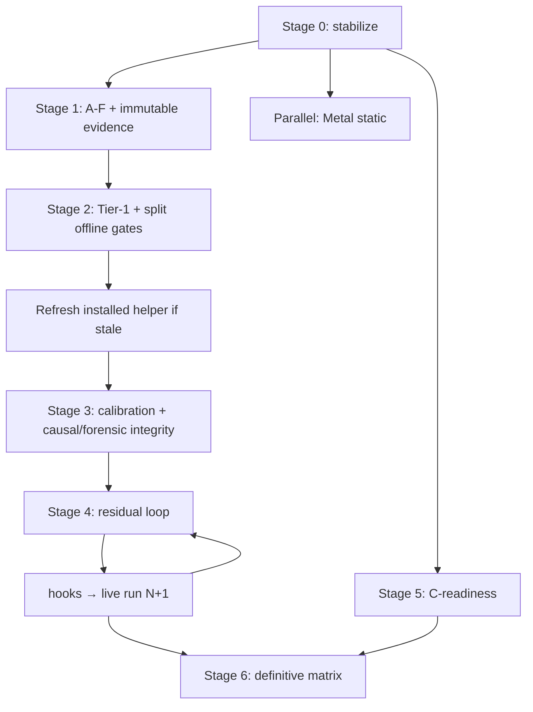

# Eu4 Performance Optimizer — profiler roadmap (authoritative, frozen)

**Scope:** Primary track = **paused-frame profiler** on [`profiler-overhead-calibration`](https://github.com/HagbardCel/eu4-mac-perf/tree/profiler-overhead-calibration) at **`bad232c7`** (CI red: argparse indent). **Parallel track 2** = exhaustive Metal static feasibility (independent gates). **Roadmap + implementation contracts frozen** — remaining work is execution (Stage 0 onward), not experimental design.

**Contracts:** [analysis/frame-model-correction-plan.md](analysis/frame-model-correction-plan.md), [analysis/frame-model-protocol.md](analysis/frame-model-protocol.md).

**Numbering:** **Stages 0–6** only.

---

## Implementation vs roadmap (must close in Stages 2–3)

The document already separates **causal** and **forensic** evidence. At **`bad232c7`**, several **single cumulative gates** still reconnect them:

| Area | Current code (`bad232c7`) | Required |
|------|---------------------------|----------|
| **Offline preflight** | One `overhead_gate`: reference/counters/sampled; `representative["status"]` fails if **any** stage fails → blocks `run --calibration-only` even when only forensic sampled fails | **`offline_causal_admission`** (reference + counters) vs **`offline_forensic_suitability`** (sampled / A–F forensic) — reported separately; only causal admission **required** for live P0/P1/P2 unless an explicit policy says otherwise |
| **Run manifest** | Generic `offline_overhead` | Rename to **`offline_causal_admission`** + separate forensic status |
| **Live integrity** | Cumulative `hook_failures`, `dropped_records`, `origin_integrity` across TAIL | **`causal_integrity`** snapshot after P2; **`forensic_integrity`** for TAIL only |
| **Global fatals** | — | Failed production detour, corrupted shared control, etc. remain **fatal for entire run** |

```text
                 causal evidence              forensic evidence
                       │                            │
offline          causal admission            suitability / A–F
                       │                            │
live             P0/P1/P2 ≤3%                 TAIL intrusion
                       │                            │
calibration_integrity   P0/P1/P2 only (after P2)
causal_run_integrity    all causal phases before TAIL
forensic_integrity      TAIL only
                       │                            │
                       └──────── independent ───────┘
```

**Tier 2 (live)** is two gates — P0/P1/P2 alone does **not** prove total profiler overhead vs **N** (dylib + detours remain in P0/P2 `REFERENCE` mode). Tier **2a** requires explicit **N vs M vs R** control semantics and **N0/N1 bracketing**. See admission table and Tier 2a section below.

---

## Current state

| Topic | Status |
|--------|--------|
| **Core architecture** | **`f2cf2fb`**: 92 tests + native checks. Causal/forensic design on **`bad232c7`**; **gate model not yet aligned** (above). |
| **Branch CI** | **Red** — `IndentationError` on `--residual-discovery` argparse (~line 1978). |
| **Production aliases** | May forward ARB/EXT through core symbol — **production fix** + native alias test. |
| **Offline counters (`f2cf2fb`)** | ~**8.1–10.6%** wall/thread CPU; ~**1–7 µs/frame** absolute (synthetic). |
| **Offline forensic** | **+226–467%** wall — must not block causal admission once gates split. |
| **Evidence file** | `preflight()` overwrites latest pointer — **immutable archives need unique evidence IDs** (Stage 1). |
| **Powermetrics** | Repo **1200**; **installed** copy may be 420. |
| **C manifest** | 43 **unresolved** executable paths; immediate-mode not suppressible like indexed draws. |

### Stage 0 bug: residual A0 `detail=True`

```python
phases=(("A0","profile",20,False),) if residual_discovery else PHASES
```

---

## Admission tiers

| Tier | What | Policy |
|------|------|--------|
| **0** | CI, native preflight | Must pass |
| **1** | Offline **causal** synthetic admission | Frozen historical failures; revised rule via Stage 2 anti-overfitting + **mandatory held-out recipe** |
| **1b** | Offline **forensic** suitability | Sampled/A–F reported; **not** auto-blocking Tier 2 unless explicitly policy-bound |
| **2a** | Live **reference transparency** | Compare profiler **REFERENCE** population \(R\) (P0/P2) to a **declared control population** \(N\) or \(M\) — see below; **predeclared** CPU/cadence bounds + **N0/N1 bracket**; not interchangeable with “autonomous runner” without naming \(N\) vs \(M\) |
| **2b** | Live **counters increment** | P1 vs \((P0+P2)/2\) on **same primary metric** as 2a (EU IV process CPU ms/s) ≤3%; secondary: update/render CPU per frame, rates, cadence |
| **3** | Forensic **TAIL** | Intrusion/suitability; **`forensic_integrity`**; does **not** retrofail Tier 2a/2b |
| **4** | Full A/B/C/D/E | ≥95% attribution, C-readiness, cadence/drift |

### Gate tri-state + extended outcomes

Keep top-level gate status: **`passed` | `failed` | `unavailable`**.

- **`passed`** — complete declared gate passed.
- **`failed`** — valid evidence showed violation (e.g. transparency outside bound). **Do not** map native bracket drift to `failed`.
- **`unavailable`** — insufficient or inconclusive evidence; use structured fields, e.g.:

```json
{"status": "unavailable", "outcome": "inconclusive_native_drift", "reason": "N0/N1 drift exceeded tier2a_native_drift_max"}
{"status": "unavailable", "outcome": "partial_missing_cadence", "cpu_component": "passed", "cadence_component": "unavailable"}
```

### Report-kind-specific required gates (Stage 2/3 implementation)

Global `REQUIRED` must not demand C coverage or ≥95% semantics on runs that deliberately omit them.

| Report kind | Required (examples) | Not required on first pass |
|-------------|---------------------|----------------------------|
| **`calibration_only`** | format, offline_causal_admission, tier2a_reference_transparency, tier2b_counters_increment, calibration_integrity, control/reference drift | semantic ≥95%, C draw coverage, intervention integrity |
| **`residual_discovery`** | all calibration gates, causal_run_integrity, cadence, valid clean A0 scope tree | ≥95% semantic (output being improved), full C-readiness |
| **`causal` (definitive matrix)** | calibration gates, causal_run_integrity, ≥95% semantic coverage, C-readiness / draw coverage, intervention integrity, control drift, cadence | — |

Makes `release_blockers` meaningful per run type.

---

## Causal vs forensic (behavior)

### Control populations (do not conflate)

```text
N — uninstrumented native EU IV
    no DYLD_INSERT_LIBRARIES; CPU/power via external sampling (powermetrics / process stats)

M — minimal-probe EU IV
    eu4_auto_probe.dylib only (swap/pause telemetry); what autonomous_runner.py injects today

R — frame-model REFERENCE
    full profiler dylib + engine/OpenGL detours; detailed measurement mostly off (P0/P2)
```

Calling `M` “native” without qualification measures **\(R-M\)**, not **\(R-N\)**. Claims must match the experiment.

**Cadence + CPU reference (frozen before implementation — do not leave N/M interchangeable in reports):**

- **Option A (default for first definitive qualification):** **CPU transparency** uses uninstrumented **\(N\)** bracket (N0/R/N1 process CPU from powermetrics). **Cadence transparency** uses minimal-probe **\(M\)** bracket (M0/R/M1 swap rate via `eu4_auto_probe.dylib`), with **\(M-N\)** process-CPU overhead qualified separately. Report wording must state both references explicitly.
- **Option B (allowed for later residual iterations):** qualify **\(M-N\)** once; use **\(M\)** for both CPU and cadence bracketing — cadence claim is vs minimal probe, not unobservable native swaps.

Truly uninstrumented **\(N\)** cannot observe `CGLFlushDrawable` cadence without becoming **\(M\)**.

### Common primary CPU metric (Tier 2a + 2b)

Use **EU IV process CPU ms/s** from powermetrics (already collected for P0/P1/P2) as the **primary** gate metric on both tiers:

```text
Tier 2a:  R process CPU ms/s  vs  N_ref process CPU ms/s   (N_ref ≈ (N0+N1)/2)
Tier 2b:  P1 process CPU ms/s vs mean(P0,P2) process CPU ms/s
```

**Secondary 2b checks** (internal consistency, same thresholds unless policy says otherwise): Update-thread CPU/frame, Render CPU/frame, update rate, render rate, present rate.

**Composable total CPU overhead** (report multiplicatively, not by adding %):

\[
(1+\delta_{\text{total}}) = (1+\delta_{2a})(1+\delta_{2b})
\]

(Small-δ additive approximation is optional footnote only.)

### Tier 2a — reference transparency gate (thresholds frozen before first measurement)

**Logical qualification = three linked sub-runs** (not one 1,140 s session / single 1,200-sample helper spanning all launches):

```text
qualification_id Q

Q/N0/   uninstrumented or declared M control — own EU IV launch, readiness, warm-up, powermetrics lifecycle
Q/R/    profiler launch: P0 → P1 → P2 → TAIL — own lifecycle
Q/N1/   same control population as N0 — own lifecycle
```

Parent evidence record: `qualification_id`, `N0_evidence_id`, `profiled_evidence_id`, `N1_evidence_id`.

Compare **\(R\)** (REFERENCE / P0+P2) against \(N_{\text{ref}}\) on **primary CPU metric**; cadence per frozen Option A or B above.

**Probe-free native readiness (population N):** do not launch N through unchanged `autonomous_runner.py` (that injects auto_probe → **M**). External readiness, e.g. game log confirms fixture, process alive/foreground, registered scene screenshot match, pointer parked, process CPU rate stable for N seconds, minimum warm-up elapsed (save is pinned paused).

**Predeclared bounds** (`tier2a_policy_version` before first run; default proposal):

```text
tier2a_cpu_bound:           |Δ process CPU ms/s| ≤ 3%  (R vs N_ref)
tier2a_cadence_bound:       |Δ render cadence|   ≤ 3%  (when cadence arm measured per Option A/B)
tier2a_native_drift_max:    |N1−N0| / N_ref      <  3%  on primary CPU (drift gate)
```

**Gate outcomes** (tri-state `GateEvidence.record()` — see below): valid evidence outside CPU bound → **`failed`**; excessive N0↔N1 drift → **`unavailable`** + `outcome: inconclusive_native_drift` (**not** `failed`); missing cadence arm → **`unavailable`** + `outcome: partial_missing_cadence` with per-component status (do not silently pass cadence).

**Stage 4+ hook iterations:** full Q/N0/R/Q/N1 (and cadence arm if Option A) on **first** qualification and whenever the **passive profiler layer** changes; reduced bracket cadence only with explicit justification.

### Tier 2b — incremental counters

```text
P0  reference → P1  counters-only → P2  reference
```

Primary: P1 vs \((P0+P2)/2\) **process CPU ms/s** ≤3%. Secondaries: frame CPU + cadence as above. Does not prove total overhead vs **\(N\)** without Tier 2a.

**Decomposition:** \(N\to R\) (2a) and \(R\to P1\) (2b) compose via \((1+\delta_{\text{total}})=(1+\delta_{2a})(1+\delta_{2b})\).

Historical autonomous benchmark (~1094 ms CPU/s, ~52.6 swaps/s) is a **sanity check only** — not a substitute for bracketed N0/N1 on the artifact under test.

**First bounded live action** (after Tier-1 causal admission + helper + **Stages 2–3 gate/integrity code**):

```bash
python3 benchmark/eu4_frame_model.py run --calibration-only
```

**Residual discovery** (after Tier 2 passes):

```text
P0 / P1 / P2 → ANATIVE → A0 (capture-free) → TAIL (forensic)
```

**TAIL rule (performance + integrity):**

> High forensic intrusion, forensic queue loss, or forensic-only provenance gaps **do not** retroactively fail Tier 2; they invalidate **forensic** evidence. Global probe/control/hook corruption remains **fatal**.

**A–F offline** (Stage 1): run before hot-path optimization; distinguish \(B-A\), \(C-A\), \(D-C\), E/F.

| Mode | GPU ts | Forensic | Metadata |
|------|--------|----------|----------|
| A–F | per correction plan / branch harness | | |

---

## Dependency graph



---

## Stage 0 — Stabilize `bad232c7`

1. Fix argparse `IndentationError`.
2. Residual A0 **`detail=False`**.
3. Schema-2 / new-role **test migration** (separate from production alias work).
4. **Production exact alias forwarding** (`glFooARB` → original ARB target; canonical identity for accounting only) + **native alias pair test**.
5. Green CI + `preflight --static-only` + native harnesses.

---

## Stage 1 — A–F diagnosis + immutable evidence

1. Full **A–F** matrix on mesh / borders / text_ui; decomposition report before optimization.
2. **Never overwrite** a prior immutable archive. Each preflight/A–F run gets a unique **evidence ID** (UTC timestamp or run UUID), because the same source SHA can produce many runs (e.g. Tier-1 validation reruns):

```text
analysis/evidence/
    frame-model-offline-f2cf2fb-20261002T061500Z.json
    frame-model-offline-<source-sha>-<evidence-id>.json
```

`analysis/frame-model-offline-evidence.json` is **only** a generated pointer / latest summary — not the canonical store.

Each immutable record includes: **evidence ID**, git commit, **profiler artifact hashes** (see Stage 6), test-library SHA, generated header SHA, harness SHA, recipe hashes, **policy version**, trial data, environment metadata — so trials can be **re-evaluated** under a new Tier-1 rule without rewriting history.

### Checkpoint (after Stage 1)

**Decision:** Is forensic slowdown understood enough to target fixes, or is forensic capture **demoted to structural-only** evidence for now?

---

## Stage 2 — Tier-1 admission + offline gate schema

### Anti-overfitting (mandatory held-out)

1. Preserve all historical 3%/5% results **verbatim** in `analysis/evidence/`.
2. Revised Tier-1 from **a priori error budget** (relative + absolute per frame), not tuned to mesh/borders/text_ui outcomes.
3. **Freeze** written rule.
4. Validate on:
   - **fresh seven-pair** trials on the original recipes, **and**
   - **at least one held-out structural recipe** not used to formulate the rule.

**Held-out sequence (no peeking):**

```text
derive error budget
    ↓
write proposed rule
    ↓
choose + implement + hash-freeze held-out workload
    ↓
measure held-out under proposed criterion
    ↓
evaluate rule
```

The held-out recipe (e.g. mixed paused frame, terrain-heavy, UI-light, postprocess/resource workload) must be **chosen, implemented, and hash-frozen before its performance is measured** — not selected after inspecting candidate numbers.

> **A–F may motivate a revised Tier-1 policy but must not alone validate a threshold chosen from those same measurements.**

5. **Tier 2a and 2b** remain non-negotiable for live qualification; freeze **tier2a_policy_version** before first 2a run; do not claim “total profiler ≤3%” from 2b alone.

### Code: split monolithic `overhead_gate` ([benchmark/eu4_frame_model.py](benchmark/eu4_frame_model.py) `preflight()`)

Implement explicitly:

```text
offline_causal_admission
    reference + counters
    REQUIRED for run --calibration-only and live P0/P1/P2

offline_forensic_suitability
    sampled / A–F forensic evidence
    reported independently
    NOT automatically causal-blocking
```

- Remove “any one failure → `representative['status']` → abort all live work” for forensic-only failures.
- If policy retains sampled ≤5% as mandatory for *some* later step, that must be an **explicit** decision — not accidental via old `representative["status"]`.
- Manifest: **`offline_causal_admission`** + separate forensic status (replace generic `offline_overhead`).

**Gate:** tests prove calibration-only can proceed when causal offline passes and forensic offline fails (and vice versa reporting).

Implement **report-kind-specific `REQUIRED` gate sets** (table above) in analyzer/release-gate logic.

---

## Stage 3 — Helper + calibration-only + integrity split

1. Reinstall **installed** [powermetrics helper](benchmark/powermetrics_helper) only if stale (repo already 1200). **Power-mode/LPM helper** is separate — hash and verify independently before Stage 6 LPM work. **One helper lifecycle per sub-run** (Q/N0, Q/R, Q/N1), not stretched across the full qualification.
2. `run --calibration-only`: logical **qualification_id** with three sub-runs (N0, profiled P0/P1/P2/TAIL, N1); Tier **2a** + **2b** on **process CPU ms/s**; cadence per frozen Option A/B; extended gate outcomes for inconclusive/partial.
3. **Integrity hierarchy** (implement in controller/run path):

```text
calibration_integrity
    phases P0/P1/P2 only
    evaluated after P2
    must PASS before ANATIVE / A0 / interventions

causal_run_integrity
    every causal phase through final A/LPM (before TAIL starts)
    snapshot immediately before TAIL

forensic_integrity
    TAIL only
```

Later causal phases (ANATIVE, A0, A/B/C/D/E, LPM) can produce drops, hook failures, and unknown-origin calls — a clean calibration must not shield a corrupt intervention phase.

**Asynchronous telemetry rule:** `hook_failures` and drop counters are synchronous; **origin (`O`) records are queued**. Classify origins **after final drain** by embedded epoch/phase:

```text
calibration (P0/P1/P2)?
later causal phase?
forensic TAIL?
```

—not by serialization time. Use **counter deltas** at boundaries for drops (e.g. calibration window vs pre-TAIL causal window vs TAIL).

- Do not apply cumulative drops/origins across TAIL when judging **calibration_integrity** or **causal_run_integrity**.
- **Global structural failures** (detour install, shared control corruption) still fail the entire run.

4. Stop on Tier **2a/2b** or **calibration_integrity** failure before proceeding; on full runs, **causal_run_integrity** must pass before interpreting TAIL; forensic-only issues → partial forensic qualification only.

### Checkpoint (after Stage 3)

**Decision:** If live **2b** (and **2a**) qualify, **stop optimizing the causal profiler** for admission purposes even if synthetic Tier-1 percentages still look high. Tier 2 is the ultimate live causal gate.

---

## Stage 4 — Residual discovery + hook loop

```text
residual-discovery run N
    → largest residual (clean A0)
    → offline RE
    → 3–8 ABI-verified hooks (top paths only)
    → CI + native tests
    → offline causal admission revalidation (+ forensic suitability reported)
    → residual-discovery run N+1   (mandatory; opens with P0/P1/P2)
    → recompute coverage until ≥95% Update/Render attribution (then **stop adding hooks** — 95% is a decision threshold, not a chase to 99–100%)
```

**Re-qualification rule (Stages 4 and 5):** Any production profiler/interposer change (hooks, observer wrappers, alias forwarding, resolver paths, draw coverage) **invalidates** previous Tier-1/Tier-2 qualification for that build. Before the next live run: static/native CI → **`offline_causal_admission`** on the new artifact → run (which always opens with fresh P0/P1/P2). Stage 4 hook batches already follow this; **Stage 5 C-readiness changes must too.**

**Future (optional):** after a qualified first TAIL, consider `run --residual-discovery --no-forensic-tail` for hook-only iterations when structural capture unchanged — reduces expensive game runs; not required for initial implementation.

### Checkpoint (after Stage 4)

**Decision:** Once ≥95% meaningful Update/Render attribution is achieved, **stop hook expansion** and proceed toward C-readiness gate + definitive matrix prep.

**Config isolation:** parallel [benchmark/eu4_benchmark.py](benchmark/eu4_benchmark.py) runs must **restore** canonical profiler fixture/settings/playset/display before paired profiler work.

---

## Stage 5 — C-readiness (parallel from Stage 0)

### Artifact isolation vs Stage 1 A–F

```text
Stage 5 static RE / dataflow / Mach-O analysis     ✓ parallel with Stage 1

Stage 5 production observer / interposer / hot-path changes
    → separate branch until Stage 1 A–F + checkpoint complete
    → on merge: new artifact identity → regenerate applicable A–F / admission evidence
```

Do not interpret Stage-1 A–F numbers measured on artifact **X** after merging hot-path changes that produced **X′**.

Four-state taxonomy (aligns with schema 2):

| State | Meaning |
|-------|---------|
| **candidate-only** | SDK/export/string evidence; no executable reachability |
| **unresolved** | Executable/pointer path may be reachable — **blocks C** |
| **reachable + suppressible** | Covered observer + validated suppression |
| **reachable + not suppressible** | Needs semantics or proof of irrelevance to measured workload |

“Proven unreachable” resolves from investigation of candidate/unresolved entries. Immediate-mode (`glBegin` / `glVertex*` / `glEnd`) = multi-call **rendering mechanism**, not three independent draw APIs.

Work: 43 paths, GLEW/resolver, exact aliases, observer tests — mostly without EU IV launches.

**Re-qualification:** Observer/forwarding/resolver changes here alter hot-path overhead — see Stage 4 re-qualification rule before any Stage 6 run.

---

## Stage 6 — Definitive matrix

**Prerequisites:** Stages 0–5 complete; **profiler artifact identity** matches verified CI/preflight for this Mac run.

**Launch sequence:**

```text
final Stage-5 artifact
    ↓
static + native CI green
    ↓
offline_causal_admission (current build)
    ↓
full run begins → N0/N1 bracket + Tier 2a/2b → causal phases → causal_run_integrity check → TAIL
    ↓
only then interpret A/B/C/D/E30/E15 contrasts (+ LPM / optional DVFS; both helpers verified)
```

**Artifact identity** (record in manifest and immutable evidence — not a single C-file hash):

```text
git_commit
git_tree_clean = true          # no dirty worktree for evidence-producing live runs
profiler_dylib_sha256
draw_observers_sha256
draw_manifest_sha256
site_header_sha256
controller_sha256
game_executable_sha256
powermetrics_helper_sha256     # Stage 3 sampling
power_mode_helper_sha256       # Stage 6 LPM only; independent from powermetrics
offline_admission_policy_version
tier2a_policy_version
tier2a_control_population          # N | M
auto_probe_dylib_sha256            # if M
qualification_id
N0_evidence_id
profiled_evidence_id
N1_evidence_id
tier2a_cadence_reference           # option_a_split | option_b_minimal_probe
tier2a_native_evidence_id          # bracket archive (legacy alias ok if sub-IDs present)
offline_causal_evidence_id
forensic_evidence_id
fixture_save_sha256
settings_sha256
playset_dlc_fingerprint
display_mode_fingerprint
```

Connects the binary under test to the **policy and evidence IDs** that authorized the run.

Matched **A/B/C/D/E30/E15**, natural LPM, optional fixed-DVFS; ≤2 architectural changes with causal evidence.

---

## Parallel track 2 — Metal static feasibility

Independent of profiler Stages 0–6 (neither blocks the other).

Offline Gfx→GL→Metal matrix (inventory, resources, shaders, compatibility profile, presentation).

**Two decisions:**

```text
Static lane:     technical feasibility + contained replacement boundary
Profiler lane:   measured dominant cost + implementation priority + expected benefit
```

Static work **may** support a technical “contained backend replacement appears feasible / infeasible” judgment. **Implementation priority and expected performance benefit require profiler evidence** — static analysis alone does not decide “Metal is the optimization to build next.”

---

## Success criteria (ordered)

1. **Stage 0** — CI green; capture-free A0; aliases; schema-2 tests.
2. **Stage 1** — A–F documented; **immutable** evidence with unique **evidence IDs**; checkpoint decision on forensic role.
3. **Stage 2** — Split offline gates; Tier-1 validated with hash-frozen held-out (no peeking).
4. **Stage 3** — Tier **2a+2b** + calibration-only; **calibration_integrity** + **causal_run_integrity** + forensic split; async origin classification; checkpoint if live gates pass.
5. **Stage 4** — Hook loop with live **N+1**; ≥95% then stop hooks; re-qualification after interposer changes.
6. **Stage 5** — C-readiness (four-state); re-qualification before Stage 6 if hot path changed.
7. **Stage 6** — Full **artifact identity** + clean worktree; offline admission then fresh P0/P1/P2 then matrix; ≤2 targets.
8. **Metal track** — feasibility advanced; implementation priority only with profiler evidence.

---

## Execution environment

- Branch: `profiler-overhead-calibration` or `cursor/*-60a0` PRs.
- Cloud: Stages 0–2 gate work, 1, 5, Metal.
- Mac / self-hosted: display preflight, helper, Stages 3–4, 6.
